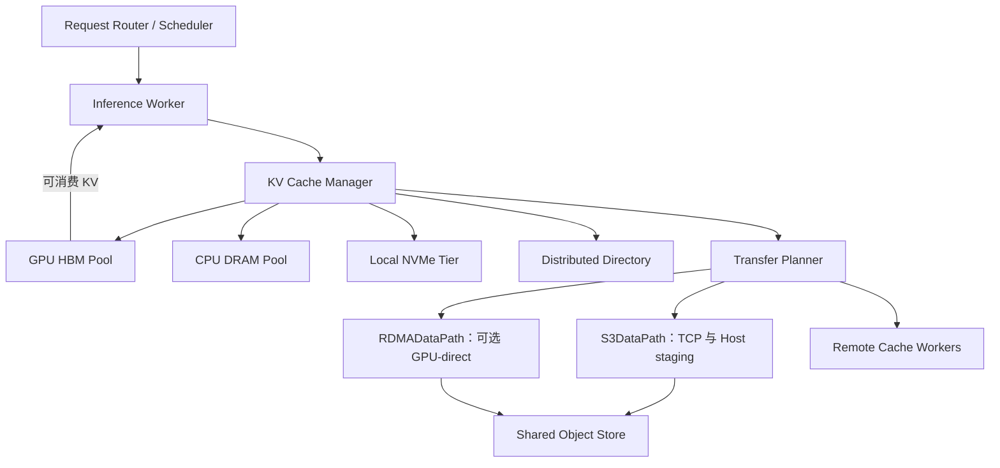
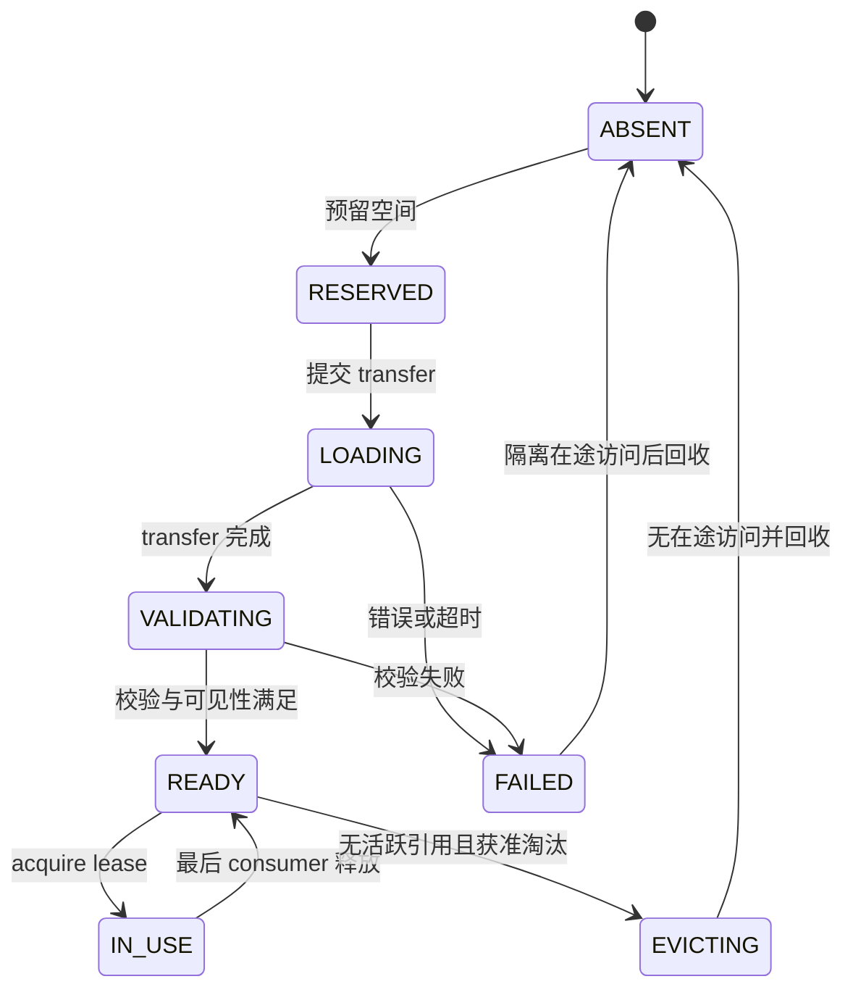
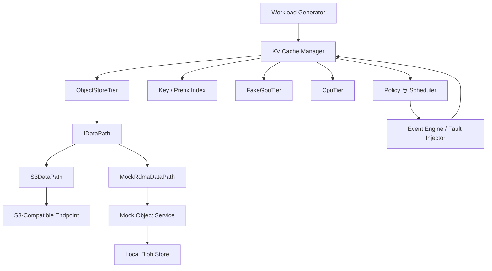

# AI Storage System Design & Interview Guide

> Document 3 · 系统设计、面试答案与 Demo 规格  
> 核实日期：2026-09-19。以下系统是**面试与 Demo 的 architecture proposal**，不是某厂商产品规格或已实测性能。
> 面试版修订：2026-09-20。重点补充连续追问、容量落地、故障预算与闭卷验收；完整接口作为后续实现参考。
> 2026-09-25：新增冷 Prefix 跨 S3/GPU 案例，校准 ECS/ObjectScale 个人项目卡，并把可选 Demo 统一为 C++ 基线与模拟；所有数值推演仍为教学输入。
> 2026-10-03：补三类场景、Compatibility Contract、A/B/C 实验规格与排障矩阵；未宣称新硬件/集成实验通过。

## 第一遍阅读导航

| 先读 | 达标输出 | 实现时再查 |
|---|---|---|
| §1～6：一次冷 Prefix 请求 | 预算、恢复决策、发布与安全回收 | 长 schema、完整状态清单 |
| §7：限时设计和个人项目 | 讲清本人工作，再连接新场景 | 30 道题按错题选读 |
| §8.1、§8.7、§8.12：Demo 边界 | 明确自己做到哪个阶段 | §8.2～8.4 接口与全量模拟架构 |
| §9：闭卷验收 | 换数字与故障条件仍能回答 | 不以硬件 Demo 当投递门槛 |

网站日程见[使用指南]({{ site.baseurl }}/docs/00_Study_Guide/)；第一次写 C++ 从[小实验]({{ site.baseurl }}/docs/04_CPP_Labs/)开始，不要求先实现所有类型。

## 目录

- [0. 你要交付的面试答案](#chapter-0)
- [1. 先约束 workload，再画架构 — MUST KNOW](#chapter-1)
- [2. KV Cache Key：identity、representation、location 分离 — MUST KNOW](#chapter-2)
- [3. 请求路径与状态机 — MUST KNOW](#chapter-3)
- [4. Cache Policy、Prefetch 与层间迁移 — MUST KNOW](#chapter-4)
- [5. Failure、Retry 与 Idempotency — MUST KNOW](#chapter-5)
- [6. Performance Model：必须能当场算 — MUST KNOW](#chapter-6)
- [7. Interview Guide：30 个必答题与展开顺序 — MUST KNOW](#chapter-7)
- [8. Demo Design：GPU KV Cache Object Store — SHOULD KNOW](#chapter-8)
- [9. 本月毕业验收](#chapter-9)

<a id="chapter-0"></a>

## 0. 你要交付的面试答案

题目：**Design a GPU-aware distributed KV Cache storage system.**

好的答案必须同时闭合三条线：

1. **语义正确：**命中的 KV 属于正确模型与上下文，内容完整，设备可以安全消费。
2. **经济有效：**比重算省 GPU 时间，且传输、容量和尾延迟不把收益吃掉。
3. **工程可运行：**跨层回收、并发、失败、回退和监控有明确规则。

| 等级 | 本篇内容 |
|---|---|
| MUST KNOW | key、目录与数据分离、cache policy、promotion、失败/重试、传输估算、S3/RDMA 双路径 |
| SHOULD KNOW | 路由、跨层流水、元数据扩展、热点、租户隔离、benchmark 设计 |
| NICE TO KNOW | 多区域 KV 共享、更复杂的压缩/近似复用、引擎无关 KV 格式 |
| SKIP FOR NOW | 完整生产共识系统、真实 RNIC driver、全量 vLLM 集成、生产级多租户平台 |

**本篇的 MUST KNOW 指能解释设计决策，不要求复刻完整实现。** §2.2 的详细 schema、§3.3 的全部状态名、§8 的接口签名只需 SHOULD KNOW。先说清 key 绑定什么、什么时候 READY、什么情况下不能回收，再按追问展开具体字段。

“能回答三层”在本篇的标准是：第一层提出方案；第二层用预算或不变量证明；第三层在条件变化/故障时修改方案。把三份教程中的所有术语堆进一张图，并不比明确的简单方案得分更高。

<a id="chapter-1"></a>

## 1. 先约束 workload，再画架构 — MUST KNOW

### 1.1 面试开场必须问的内容

不是列十几个开放问题等面试官定义一切。先问最影响设计的三组，然后主动给出假设：

| 问题 | 为什么会改变设计 |
|---|---|
| 主要做 prefix reuse、暂停恢复，还是活跃 KV 的每步容量扩展？ | 决定对象层是否位于 Decode 关键路径 |
| 模型、token 长度分布、并发、reuse 分布和 TTFT/ITL SLO？ | 决定每请求 bytes、容量、网络与缓存价值 |
| 部署是否同机房、具备何种 GPU/NIC，KV 丢失能否重算？ | 决定 RDMA/GPU-direct、故障保护与降级 |

本题示例假设：同机房推理集群；GQA 模型参数沿用 Document 1；这里的 8K/2K tokens 分别表示 8,192/2,048，8K cached tokens 约 1 GiB/request；先服务**可复用 prefix 与暂停请求**，活跃 Decode 工作集优先 HBM。下面用 TTFT p95 300 ms、ITL p99 30 ms 作教学 SLO；它们不是对硬件性能的承诺。

<a id="remote-kv-scenarios"></a>

### 三类远端 KV：先选问题，再选后端 — MUST KNOW

| 场景 | 目的与生命周期 | 核心操作 / 面试重点 | 技术定位 |
|---|---|---|---|
| Prefill → Decode KV Transfer | 一次 inference request 的阶段交接；源 KV 保活到目标安全接收，消费可能持续整个请求 | transfer、latency、bandwidth、topology、GPU-to-GPU / GPU-aware 路径、request lifetime | NIXL、Mooncake **Transfer Engine** 可封装 RDMA/NVLink 等受支持路径；需要 connector 接入 runtime |
| Distributed / Shared KV Cache | 不同 worker/instance 跨请求复用 prefix；保留期由价值与容量决定 | lookup、identity、admission/eviction、dedup、locality/routing、replication、capacity、failure | LMCache、Mooncake **Store**、vLLM connector ecosystem；快传输不能替代缓存管理 |
| Durable / Cold KV Storage | 更大、更便宜、更远的冷层；耐久的是所发布 blob，是否可复用仍要检查 | Object Storage、S3 semantics、namespace、durability、capacity、Range、restore vs recompute、failure domain | 对象服务作为 backend；cold 不自动意味着 durable，保护保证由 endpoint 决定 |

**P/D Transfer ≠ Distributed KV Cache ≠ Object Storage Tier。** 前者是阶段间的交接问题，中间是复用与管理服务，后者是容量/持久化后端；三者可以组合。例如 P 从共享缓存恢复前缀并计算后缀，再直接交给 D；请求结束后只把值得保留的 immutable KV 放冷层。整个过程不要求即时交接经 S3。

反例：一次交接也需要 request ID、lease 和失败处理，但不因此成为带跨请求 lookup/淘汰/副本策略的共享缓存。反过来，一个支持 S3 GET 的 bucket 也不会自行理解 prefix、TP 分片或 GPU-ready。技术栈定位见[第一篇 §6.7]({{ site.baseurl }}/docs/01_AI_Storage_KV_Cache/#modern-kv-stack)；本表是设计判断框架，具体集成以官方版本为准。

### 1.2 五个不变量比功能列表重要

1. 只有兼容模型/输入/表示的 KV 才能命中。
2. 只有完整、校验通过、满足设备可见性的块才可发布 READY。
3. 有 consumer 或 in-flight transfer 的 buffer 不可被重用。
4. Directory 的 stale entry 只能造成 miss/重试，不能造成静默错误命中。
5. 缓存失败不破坏权重与 token 原始来源；允许重算，但要受服务容量控制。

### 1.3 概念架构



目录管理“有哪些逻辑块、保存在哪、什么格式、能否访问”；data path 搬 bytes；tier 管容量和生命周期；scheduler 决定何时值得恢复。**不可把这四个职责都塞进一个 S3 GET wrapper。**

图中 remote/object 层与 HBM 之间可直达，不要求每次依次穿过 NVMe、DRAM。逻辑层级不等于固定物理路径。

### 1.4 为什么没有把所有 GPU 连成一个无限内存池

远端 memory 仍有网络带宽、拓扑和故障边界。简单 pooling 能提供容量，但活跃消费者仍要获得可访问的数据。传输、prefix-aware routing 和局部副本是必要成本，不能只说“RDMA 一把梭”。

<a id="kv-system-capacity"></a>

### 1.5 给出第一版可计算的部署，而不是画完架构就结束 — MUST KNOW

用四个独立 worker 做容量示例，每个有 **56 GiB 实际 KV budget**，模型计算能力与权重空间另行满足。100 个并发请求均匀分配，每个初始 8K prompt，预计再缓存约 2K 输出；仍按 128 KiB/token，无跨卡 KV 分片。

| 假设 | 每 worker 的 KV payload | 集群总 payload |
|---|---:|---:|
| 25 请求/worker，最终每请求 10K，无共享 | `25×1.25 = 31.25 GiB` | 125 GiB |
| 每个 worker 的 25 请求共享同一个 4K prefix，其余 6K 私有 | `0.5 + 25×0.75 = 19.25 GiB` | 77 GiB |

集群共享场景保留了四份 HBM 公共前缀，不能只按一份计算。这里还没加 allocator、in-flight reservation 和安全余量；算得下也不等于能满足每秒输出速度，要继续验算 compute、HBM 带宽与队列。

第一版可以据此做三个明确选择：

1. 活跃 KV 留 HBM；CPU 保留短期复用，只有值得保存的 immutable prefix 进入对象层。Local NVMe 先作为可选项，有近端容量需求再启用。
2. 先把 S3→pinned DRAM→GPU 定为功能基线；支持的 GPU-direct 作为可切换后端，比较节省了哪段成本。
3. 目录记录模型/前缀身份、表示与位置；每节点 manager 管实际 buffer，恢复前预留目标，避免控制端维护长期 GPU pointer。

这不是硬件采购或部署建议，而是面试中的一组可验证假设。下一轮追问改变并发、长度或机器数时，更新这些数字和选择即可，无需重画一个更复杂的平台。

<a id="kv-cold-prefix-request"></a>

### 1.6 贯穿案例：1 GiB 冷 prefix 的一次请求 — MUST KNOW

用 [Document 1 的四场景判断]({{ '/docs/01_AI_Storage_KV_Cache/' | relative_url }}#chapter-0)先限定：**这是一段跨请求可复用、当前不活跃的 8K prefix**，不是活跃 Decode 每步读取，也不是刚结束的 Prefill worker 与 Decode worker 之间的即时交接。本例有 16 个 64 MiB 逻辑传输块；实际 GPU pages 可能分散。阅读下面的顺序时，要能指出每一步的身份、空间和完成条件：

1. Router 拿到 token 前缀和模型身份；KV manager 找到兼容的完整 prefix，目录返回可用副本、对象版本/不可变 key、表示格式和范围，而不是一个长期 GPU pointer。
2. Planner 用当下排队、后端有效带宽与重算耗时决定是否恢复。教学输入下 `1 GiB / 8 GiB/s + 8 ms = 133 ms`；若重新 Prefill 要 400 ms，可评估从冷层恢复；若只要 60 ms，则在相同串行假设下优先评估重算。**命中不强制读对象层。**
3. 若决定恢复，先 reserve HBM 目标与必要的 GPU staging，持有 allocation generation/lease；再从目录对应的对象位置读取。基线是 `S3 → host → H2D`，双方实际支持时才选 `S3 控制请求 + RDMA payload → GPU`。[Document 2 §7.9]({{ '/docs/02_GPU_Data_Path/' | relative_url }}#chapter-7)逐段列出了服务端读取、EC、descriptor 与 GPU 转换。
4. 收齐所需 chunk，核对范围、长度、版本、checksum 与布局；确认传输不再写目标，完成必要的 GPU 转换和消费顺序，最后 publish READY 并安装 block table。未命中的后缀仍要 Prefill；后续 Decode 仍读历史 KV。
5. 若中途 timeout，先隔离部分写入的 target，另用安全目标 fallback 或受控重算；旧目标等 drain 后回收。对象层大范围故障时，限制重算准入，保护已在 Decode 的请求。

面试收尾给出四项证据：`load-to-GPU-ready p50/p99`、避免的 Prefill GPU 时间、TTFT/ITL 与满足双 SLO 的 goodput、后端读放大/CPU/DRAM/NIC/PCIe 消耗。一次请求在预算内不等于整体 p99 达标；需要相同 workload 的 A/B 测量。上述 133 ms 是教学时间，不是任何对象产品的承诺。

### Interview Check

**30 秒回答 — Design overview**

> I keep the active Decode working set in HBM and manage reusable immutable KV blocks across DRAM, NVMe and a shared remote tier. A directory identifies compatible blocks, while a transfer planner selects TCP or supported GPU-direct paths. Publication requires integrity and device visibility, and loading must be preferable to recomputation.

**2 分钟回答**

我先限定这是 exact prefix reuse 和暂停恢复系统，不默认每 token 都从对象层读 KV。推理 worker 内有 KV manager 和分级容量池，集群目录保存兼容身份与副本位置，transfer planner 根据 deadline、带宽和能力选择 S3/TCP 或 GPU-direct。请求进入后查 prefix，做目标容量 reservation，再恢复命中块并计算缺失后缀。只有完整且对 GPU 可见后才安装到 block table。请求结束后释放活跃引用，有价值的 immutable prefix 异步保存，低价值直接丢弃。缓存可重算，所以故障时允许 miss/fallback，但防止全量重算风暴。最后用 TTFT、ITL、节省的 Prefill GPU 时间与浪费搬运字节验证价值。

**Deep Dive**

1. **Q：目录必须记录每个 GPU 地址吗？** A：长期目录记录逻辑块与 node/tier/format/epoch；临时地址/rkey 在传输时协商，不能持久化为稳定位置。
2. **Q：对象层挂了是否整个推理都挂？** A：已在 HBM 的活跃工作可继续；新 miss 可从其他 tier 或重算，受 admission control 限制。
3. **Q：为什么不一开始做跨 region？** A：WAN 延迟、带宽、成本和版本治理会干扰本题核心；先证明同机房有净收益，再讨论远距离冷缓存。

**Common Trap：**先堆框架名；不问 workload；把存储层与传输层混为一谈；没说明恢复失败后的推理行为。

<a id="chapter-2"></a>

## 2. KV Cache Key：identity、representation、location 分离 — MUST KNOW

### 2.1 三种 ID 服务三个问题

| ID | 回答什么 | 稳定性 |
|---|---|---|
| Semantic identity | “这是不是同一份计算结果？” | 随模型、前缀、位置等计算条件变化 |
| Representation identity | “这些 bytes 能否按当前布局消费？” | 随 dtype、量化、layout、分片、format version 变化 |
| Location / capability | “现在可以从哪里读或向哪里写？” | 随 node、allocation、MR、lease/epoch 变化 |

不要把 `request_id` 当作唯一内容 key，否则跨请求复用失效；不要把 GPU pointer 当 content key，它可以重复利用。

### 2.2 一个足够完整的教学 schema — SHOULD KNOW，字段含义为重点

以下是规格示意，不是生产标准。所有 Hash 输入都需要确定性的字段顺序、类型和长度编码。

```text
ModelNamespace:
  tenant_or_share_group
  weights_revision_or_digest
  model_config_digest
  adapter_or_LoRA_revision
  tokenizer_and_input_preprocess_revision
  position_and_attention_config_digest

PrefixIdentity_i = Hash(
  PrefixIdentity_(i-1), exact_token_ids_in_chunk,
  multimodal_input_digest, ModelNamespace
)

LogicalBlockId = Hash(
  ModelNamespace, PrefixIdentity_i,
  token_start, token_count, absolute_position_scheme,
  layer_start, layer_count
)

StoredBlobId = Hash(
  LogicalBlockId, dtype, quantization_metadata_version,
  layout_version, shard_spec, format_version
)

Location:
  node_or_endpoint, tier, object_key_or_local_handle,
  node_epoch, content_checksum, byte_length, expires_at
```

解释关键字段：

- **Model/version** 不只是显示名称。权重修订、LoRA 和结构配置变化都可能改变 KV。
- **Prefix** 必须绑定前文；同样局部 token range 在不同历史下不能视为相同 KV。
- **Layer/range** 说明包含哪些层、哪些 token；全层 blob 可以填整个层范围。
- **Position/attention config** 包括 RoPE、mask/window 等影响计算的配置；不能把相同 tokens 在不同位置的 KV 无条件互换。
- **Precision** 不止 FP16/FP8 名字；量化 scale 的组织与布局版本也要兼容。
- **Shard spec** 包括所存层/head 的分片范围及预期消费布局。部署 TP 数不同可能需要转换/reshard，不是同一模型就可直接 memcpy。
- **Tenant/share group** 默认隔离；只有明确授权且语义兼容的公共 prefix 才跨租户共享。

Tokenizer 信息有时只是保守隔离/溯源：若真实 token ID、模型和所有输入条件完全相同，数学上未必依赖 tokenizer 的名字；本月优先选择安全、可解释的 namespace，接受少量过度分隔。

### 2.3 Hash 不等于内容完整性

内容身份 hash 回答“希望存什么”；payload checksum 回答“读到的 bytes 是否损坏”；鉴权回答“谁能读”；三者不可互相替代。跨语言 hash 还要固定 canonical encoding，不能直接拿进程随机 hash 或不稳定对象序列化当长期格式。

vLLM 当前 prefix hash 设计支持 parent hash 与额外身份信息，是本题 key 链的参考；这里补充的跨存储布局/副本协议是本文设计，不是对其内部 schema 的声明。[vLLM Prefix Caching](https://docs.vllm.ai/en/latest/design/prefix_caching/)

### 2.4 Stale KV 与 TTL

以下三者不同：

| 情况 | 处理 |
|---|---|
| 模型/上下文不匹配 | 语义无效，不能命中；换 namespace |
| Directory 指向已丢失位置 | 验证位置失败，降级 miss/重试其他副本 |
| 内容仍正确但太旧/不热门 | 策略层可因 TTL/容量淘汰，不是数学上失效 |

TTL 用于保留策略和清理，不能修补错误 key。模型升级用 namespace/version 隔离，新请求不再访问旧版本；旧版本等活跃引用结束后清理。不会通过“把 TTL 设短”保证模型正确性。

<a id="kv-compatibility-contract"></a>

### 2.5 KV Compatibility Contract：相同逻辑 KV 不保证可直接消费 — MUST KNOW

**Identity compatible ≠ Representation compatible ≠ Runtime compatible。** Identity 判断是不是正确计算结果；representation 判断 bytes 的几何/编码/分片能否解释；runtime 判断 consumer 和 connector 能否在当前实现中安全安装与消费。Location 可达和 checksum 正确是另外两项，不能替代这三道检查。

不再扩一套无限字段 schema，只在 §2.2 的 manifest 和传输握手中明确三组约束：

| Contract | 至少核对 | 不兼容时的动作 |
|---|---|---|
| Identity | model identity + 权重 revision；attention architecture/位置规则；完整 prefix/input 身份与授权 | 不是同一计算结果则 miss/recompute，不能仅靠转换 dtype 修复 |
| Representation | KV dtype、layer count、KV head count、head dimension；TP rank/head 分片；block/page layout；quantization metadata（scale 的版本、组织与可获得性） | 只有已实现且验证正确的转换/reshard 才允许恢复；否则 miss |
| Runtime | attention backend；runtime/connector version 与协议；支持的 memory kind、布局安装和完成/可见性契约 | 先协商支持组合，禁止关闭检查来“强行兼容” |

**教学例子：**同权重、同前缀，P 用 TP=2、D 用 TP=4。即使 hash 命中且网络完整搬到 GPU，某 rank 的 KV heads 范围或 page strides 仍可能错误。若 connector 明确支持该模型的 head splitting/布局转换，转换后验证再安装；若没有这种能力就重算。FP8 同 dtype 但缺 scale，也不能只靠 checksum 证明数值可用。

**当前产品事实：**2026-10-03 核对的 [vLLM NixlConnector compatibility matrix](https://docs.vllm.ai/en/latest/features/nixl_connector_compatibility/)说明默认 handshake compatibility hash 检查 vLLM/connector 版本、model 几何与 dtype、attention backend、cache dtype 等。TP/block size 可在特定模型和布局约束下不同，不应概括成“必须完全相同”，更不能说任意不同都兼容。该页还区分静态量化 scale 与尚不支持的动态 scale 传输，并标明特定异构布局转换为 experimental。

**通用原则与本文抽象：**上表把产品检查提炼成三道 contract，并额外要求权重 revision/内容身份核验。不宣称 vLLM 的 compatibility hash 会验证全部模型权重 bytes、tenant 或本文所有 manifest 字段；NIXL 搬运 descriptor 也不替上层证明语义一致。实现前锁定 runtime/connector/backend release 或 commit，做同输入恢复与重算的结果对照；浮动 `latest` 的支持矩阵不是长期保证。

**面试追问：**“两个 worker 能连通、搬完且 checksum 相同，为什么输出仍可能错？”先分别排 identity、representation、runtime；完成/设备可见性检查还要独立成立。

### Interview Check

**30 秒回答 — How do you identify a KV block?**

> I separate computation identity from byte representation and physical location. The key binds the model revision, tenant, full prefix context, positions and layer range. Stored metadata also records dtype, layout and sharding. A temporary RDMA descriptor is a transfer capability, not a persistent cache key.

**2 分钟回答**

一个 KV 块不是局部 token 的纯函数，所以 key 必须绑定完整前缀历史和模型计算条件。我先建立包含权重、配置、adapter、输入处理和租户的 namespace，再用前块 hash 与精确 token 构成 prefix 链，附上 token range 和 layer range。然后把数学身份与 bytes 格式分开，记录 KV dtype、scale、layout、shard spec 和 format version。这样可以区分“语义上可复用但需要转换”和“根本不可复用”。副本位置独立记录 endpoint/tier/epoch；GPU 地址和 rkey 只在一次受控传输中有效。最后 checksum 验证数据完整性，TTL 管保留，二者都不能代替正确的兼容性身份。

**Deep Dive**

1. **Q：两个请求都有同一段文档，为什么可能不命中？** A：文档前面的 system prompt、位置、tokenization 或图像输入不同，会改变 KV。
2. **Q：同模型从 TP=2 改 TP=4 怎么处理旧 KV？** A：检查分片表示，可显式 reshard/转换并重新验证，否则视为不兼容，不盲目 memcpy。
3. **Q：Hash 碰撞会怎样？** A：可能造成错误输出甚至信息泄露；采用合适强度的 hash、确定性编码、namespace 隔离和必要的元数据验证，不能说概率低就无所谓。

**Common Trap：**只用 token range；只用模型名；TTL 保证正确性；把 address/rkey 写进长期对象 key；KV hash 可以代替 payload checksum。

<a id="chapter-3"></a>

## 3. 请求路径与状态机 — MUST KNOW

### 3.1 Hit / miss 必须分级

| 结果 | 实际含义 | 后续动作 |
|---|---|---|
| HBM ready hit | 兼容且可消费，能 acquire lease | 安装/复用 block table，开始所需计算 |
| Lower-tier hit | 找到完整兼容的外层副本 | 比较 restore 与 recompute，reserve 目标，再搬 |
| Metadata-only hit | 目录有记录，尚未验证副本 | 不算有效 data hit |
| In-flight hit | 同 key 已有人在 load | 合并等待或选择其他路径，避免 duplicate load |
| Miss | 无可用副本 | 计算，之后按 admission policy 决定是否保留 |

建议分别上报 token hit rate、byte hit rate、ready hit rate 和 avoided-prefill-time；一个混合的 hit rate 会掩盖真正成本。

### 3.2 完整 cold-prefix 恢复流程

1. Router 得到 prompt token 与 namespace，查询最长可用、兼容的 prefix。
2. Scheduler 比较候选副本的预计 load-to-ready 和重算成本，检查 deadline。
3. KV manager **先 reserve 容量**，避免已经开始读才发现 HBM 无处放。
4. 取得源 location lease，分配目标 buffer lease；必要时准备 MR/descriptor。
5. Planner 选择直接恢复，或经过 pinned DRAM/布局转换；记录 request、attempt、generation。
6. 执行 async read/transfer，按层或 chunk 记录进度；未完整的块不能发布。
7. 检查数据长度、checksum、namespace/format、传输成功与 GPU 可见性。
8. 原子安装 READY metadata 与 block table；consumer acquire lease 后执行。
9. 失败则解除 reservation、废弃不完整目标、清理传输资源，受控地 fallback 或重算。

步骤 9 里的“解除”必须等硬件访问安全结束；逻辑失败和物理回收是两个时刻。

### 3.3 最小状态机 — SHOULD KNOW，发布与回收次序为 MUST KNOW



真实实现还需引用计数、多个 reader、多个副本和后台 offload，本图只表达安全次序。`IN_USE` 可用 refcount 而非独立状态实现。

### 3.4 Offload 的提交顺序

对于完整 immutable 块：GPU producer 完成 → acquire 源 lease → 向低 tier 写入临时或不可变 payload → 校验完成 → 发布外层位置 → 释放 transfer lease → 满足 eviction 条件才回收上层。

如果源块已有有效低层副本，则 demotion 可只丢弃上层副本，无需重复写。对象内容与目录发布分开后，失败可能留下 orphan blob；后台 GC 按 manifest/reachability、保留期和 lease 清理，不要立即猜测“没目录就删除”。

### 3.5 并发与去重

同一热 prefix 同时来了 100 个请求，使用 `single-flight`：一个 transfer 负责恢复，其他请求等待同一结果并 acquire 引用。每个 waiter 有自己的 deadline，某 waiter 取消不代表取消所有人的共同工作。

锁只保护目录/状态变更，不持锁等网络。发布顺序为数据完成后可见 metadata；回收顺序先阻止新引用，再等现有 consumer/transfer 退出。固定的 lock ordering 避免跨 tier 搬运互相等锁。

<a id="kv-directory-granularity"></a>

### 3.6 目录粒度：不要让一次请求查几百次远端 metadata — SHOULD KNOW

沿用一个 8K prefix：16 tokens/page 对应 512 个逻辑 page；512 tokens/transfer chunk 对应 16 个 chunk。如果逐个串行查远端目录，假设每次 0.1 ms，仅 512 次 lookup 就花 51.2 ms，尚未搬任何 KV。这是教学延迟，不是某目录系统实测。

目录可以先返回**最长连续命中范围和批量 chunk locations**，再由本地索引映射到引擎 pages。不要因为 GPU allocator 是 page 粒度，就要求对象命名、网络请求与全局目录都保持相同粒度。

容量也能检验：1 TiB KV 若按全层 2 MiB page 建条目，有 524,288 条；按 64 MiB chunk 则 16,384 条。假设每条元数据 256 B，原始条目 payload 分别为 128 MiB 和 4 MiB，还没算 hash table、副本和前缀索引。若再把每层独立列成条目，数量还会增加。

初版面试方案采用分区目录与本地缓存即可。目录 stale 允许返回 miss；内容身份、租户权限和 READY 发布不能靠“最终一致”含糊带过。这样既利用你的 metadata/placement 经验，也避免为一个可重算缓存先设计完整共识服务。

### Interview Check

**30 秒回答 — When can a loaded block be used?**

> A lookup or transfer submission is not enough. I reserve the destination, hold source and target leases, complete the transfer, verify identity and integrity, and establish GPU visibility. Only then do I publish the block as READY and allow attention to acquire it.

**2 分钟回答**

我把 lookup hit、transfer complete 和 GPU ready 三个时刻分开。请求先查兼容 prefix，再比较加载与重算，确定加载后先预留目标容量。提交期间由 context 持有源、目标和注册资源的 lease。数据传完还要检查长度、校验、版本和设备可见性，然后原子发布 READY，并把物理块映射给 attention。部分块失败不能交给 kernel；相同 key 的并发请求可以合并到一个 load。Offload 也采用先内容后位置的提交次序，上层只有在没有 consumer 和在途传输后才回收。超时必须保留隔离的 buffer，直到确认旧 DMA 不再写入，不能把逻辑失败立即等同于资源自由。

**Deep Dive**

1. **Q：目录先 publish，数据随后慢慢填，行吗？** A：只有 metadata 明确不可消费、消费者严格等待完成协议才可；不能以普通 READY 发布半成品。
2. **Q：两个 load 同时成功如何避免重复占空间？** A：使用 single-flight 或带 generation 的条件发布，失败竞争者等自身 transfer 安全结束后回收目标。
3. **Q：取消请求后能马上把 target 给下一请求吗？** A：不能；取消是逻辑状态，旧 I/O/DMA 可能仍到达，先 fence/drain/revoke 或隔离 allocation。

**Common Trap：**HTTP 200 就 GPU ready；post 成功就释放 source；cancel 就硬件停止；refcount 为零但传输在途也可回收。

<a id="chapter-4"></a>

## 4. Cache Policy、Prefetch 与层间迁移 — MUST KNOW

### 4.1 LRU 是基线，不能代替价值模型

先实现有边界的 LRU：只从 `无 consumer 引用 + 无 transfer pin + 非保留状态` 的候选块中按最近使用淘汰。然后根据 workload 加入：

| 信号 | 影响 | 反例 |
|---|---|---|
| Recency | 刚使用过的块可能马上再用 | 一次性巨大 prompt 污染缓存 |
| Frequency | 高频公共 prefix 值得保留 | 历史热门但已换版的块无效 |
| Prefix popularity | 前面的公共块可能服务很多分支 | 热前缀极短，重算比远端加载更便宜 |
| Recompute cost | 重算昂贵的长 prefix 更有保留价值 | 长 prefix 很少复用，保留成本巨大 |
| Byte size | 比较每 byte 所带来的收益 | 只按条目数会被少数大对象挤爆 |
| TTL | 及时清理低预期价值/旧 namespace | TTL 不能判断上下文兼容 |

可用于面试的启发式：

`value_density = expected_reuses × max(0, recompute_cost − restore_cost) / retained_bytes`

这不是最优算法，也不是厂商策略。它表达“收益按占用归一化”，并提醒你扣除 offload、转换、竞争与维护成本。初版 LRU + 字节配额 + TTL + admission threshold 已够，不必本月做强化学习缓存策略。

### 4.2 Admission 与 eviction 是两件事

Eviction 决定“空间不够赶谁走”；admission 决定“新块值不值得进来”。如果只做 LRU，每个从未复用的长请求也会先挤进冷层，白白写一遍。

建议基线：完整 immutable 块才进入共享缓存；活跃块始终由执行需求保留；已识别的公共 prefix 可以优先准入；一次性尾部状态直接丢弃或只短暂留近端；达到租户字节限额后有公平的拒绝/淘汰规则。

前缀是有依赖的链：保留后段而前段全缺失，可能难以立即复用。可以按连续 prefix coverage 评估价值，避免只看每块孤立 hit count。

### 4.3 Prefetch 以 deadline 和预算驱动

**较可靠的触发：**请求已排队，已知将使用某段 prefix；已分配 Decode worker，知道即将接收的 KV；支持 layerwise pipeline 时，知道下一层的消费顺序。

**较弱的触发：**猜用户下一次会问什么。一个月准备期内不做复杂预测，先用已知排队信息。

预取计划至少包含：`key, destination, expected_use_time, estimated_load_time, byte_budget, priority, cancel_token`。当实际 use time 太远，提前放入 HBM 可能污染热层，可以先到 DRAM 或保持外层。

设置总 in-flight bytes、每租户 quota、带宽预算与 HBM reserve 上限。低优先级后台 offload/prefetch 不能抢占 Decode 所需资源；高优先级并不意味着可以无限并发。

**错误预取成本**：下载但没用的 bytes、无效对象请求、被占的 MR/pinned pool、HBM 驱逐、额外转换、取消后的在途访问，以及对他人 p99 的影响。仅看平均下载速度会漏掉这些成本。

### 4.4 Promotion / demotion 不要求对称

| 路径 | 适用情形 | 关键决定 |
|---|---|---|
| Object→NVMe→DRAM→HBM | 有长期本地热度、常规读取栈 | 是否值得在每层留副本，而非只是临时路过 |
| Object→pinned DRAM→HBM | 简单可靠基线 | host pool 与 H2D 重叠 |
| Object→HBM | 经验证的 direct path | layout 能否直接消费、目标 reservation 与同步 |
| Remote DRAM→HBM | 热数据跨 worker 共享/交接 | 网络与 GPU registration；是否更值得路由到源节点 |
| HBM→DRAM→Object | 异步保存高价值 prefix | offload 何时触发，是否不必要地重复保留 |
| HBM→discard | 低价值、可重算内容 | 不要为了层级“完整”强制写冷层 |

### 4.5 路由与调度 — SHOULD KNOW

同一个 prefix 在 worker A 的 HBM 命中，但 A 排队很长，worker B 无命中但空闲。不能只按 locality 选 A。比较：

`queue_A + remaining_compute_A` 与 `queue_B + restore_or_prefill_B + remaining_compute_B`。

Cache-aware routing 应结合负载；否则热门前缀会把一个节点变成热点。策略可复制热门 prefix 到多个 worker，代价是 HBM 占用与网络预热。对 RDMA remote cache 同样要限制 fan-in、NIC 和 CQ 压力。

### Interview Check

**30 秒回答 — What cache policy would you use?**

> I start with byte-based quotas, TTL and LRU among unreferenced blocks, then add admission based on expected reuse and avoided recomputation per byte. Active or in-flight buffers are protected. Prefetch is deadline-aware and bounded, because a high hit rate is not useful if transfers hurt Decode latency.

**2 分钟回答**

我先把正确性保护和热度策略分开。消费者或传输仍在使用的 buffer 不参与淘汰。可淘汰候选初版采用 LRU、字节配额和 TTL，但还要 admission，防止一次性长 prompt 把冷层写满。进一步比较复用概率、重算成本、恢复成本和占用 bytes，优先保留节省 GPU 时间较多的 prefix。预取首先利用已排队请求，不猜未知用户行为；它需要 deadline、目标 reservation 和 in-flight bytes 限制。promotion 可以跳层，demotion 也可以直接丢弃已有低层副本的 HBM copy。集群路由同时考虑命中和排队，避免过度追求 locality 造成热点。评估看 SLO 下吞吐，不以 hit rate 单独判断好坏。

**Deep Dive**

1. **Q：LRU 为什么可能保错数据？** A：只反映最近用过，不反映未来复用、重算成本、块大小和前缀覆盖。
2. **Q：Prefetch 提升 hit rate 却降低吞吐？** A：可能占满网络/PCIe、污染 HBM 或挤占计算转换资源，应看 useful-prefetch ratio 与 SLO。
3. **Q：热点 prefix 要不要复制？** A：比较负载均衡收益与容量/预热成本；可设热点阈值、复制上限与逐步退热策略。

**Common Trap：**所有 miss 都准入；LRU 可以淘汰任何块；prefetch 越早越好；只有一条固定升降层路线。

<a id="chapter-5"></a>

## 5. Failure、Retry 与 Idempotency — MUST KNOW

### 5.1 按故障后仍存活的事实推导行为

| 故障 | 丢失/不确定的部分 | 安全恢复动作 |
|---|---|---|
| GPU failure/reset | HBM、GPU context、相关映射无效 | 撤销该 GPU epoch 下位置；其他 tier 恢复或重算 |
| Node failure | HBM/DRAM 消失；本地 NVMe 未必坏但可能不可达 | 目录 lease 到期；换 worker，不把本地 NVMe 当跨节点可用副本 |
| Network failure | transfer 是否部分完成、远端是否收到不确定 | 标记 attempt 失败，隔离目标，有限重试与其他路径 |
| Object store failure | 外层 miss 不能读取/写入 | 近端继续服务；circuit breaker；限流重算；延后非关键 offload |
| Stale KV identity | 模型/格式/输入不兼容 | 明确 miss，禁止“尽量使用” |
| Partial transfer | 目标部分 bytes 有效 | 不发布 READY，校验后重试或重建 |
| Directory stale entry | location 已淘汰或 node epoch 过期 | 重新查找/删除过期位置；结果按 miss 处理 |
| Cache index lost | payload 可能仍在，但位置不可发现 | 可扫描 manifest 重建或自然冷启动；不要扫描整个对象桶作为每次请求流程 |

GPU/节点故障后，KV 可重算不代表用户请求一定透明恢复。还需 token history、model identity、采样状态/随机数状态和调度信息；可以允许请求失败重试，也可以另设计会话恢复。本题优先保证**不返回错误 KV**。

### 5.2 读重试、写重试与迟到写

**逻辑幂等：**同一 immutable key 对应同样内容，多次 GET 不改变内容；多次写相同 payload 可以通过 content identity 和条件发布去重。

**物理并不自动安全：**第一次 RDMA WRITE 超时，target buffer 被分配给另一请求，第一次的迟到 payload 仍可能落进新内容。即使第二次请求有不同 `request_id`，硬件也不会替你理解这个业务字段。

可解释的处理方法：

- 失败 attempt 的目标进入 quarantine，直到确认旧 QP/操作已停止访问，或远端访问能力安全失效。
- 新 attempt 使用独立 allocation/generation；不能只在同一地址上换一个软件标志。
- 不把注册池槽位返还给 allocator，直到 transport backend 满足回收契约。
- 缓存 index 发布使用条件更新，避免迟到旧 attempt 覆盖较新状态。

**关键结论：generation 可以发现错误身份，但不能单独阻止 RNIC 对仍有效地址/rkey 的写入。**

### 5.3 对象层提交协议

Demo/面试可以采用：immutable blob PUT → 完整性确认 → manifest/目录指针发布。对于大 blob 的 multipart，所有 part 完成后才发布完整对象引用；失败清理未完成 upload 和 orphan。

若底层没有跨多个 key 的原子事务，用一个小 manifest 指向所有 immutable shards，并在 manifest 完整发布后把它视为可见。缓存 metadata 可以重建，不代表发布顺序可以随意。

S3 PUT 成功的语义由 endpoint 与部署保证决定；不能把一个 RDMA CQE 当成存储层已经完成复制/EC 或持久化提交的证明。

### 5.4 需要几份副本

按价值分级，不把传统对象数据的保护策略机械搬给所有 KV：

| 数据 | 可选保护策略 | 理由 |
|---|---|---|
| 一次性尾部 KV | 无额外副本 | 可重算且几乎不复用 |
| 热公共 prefix | 多节点 DRAM/HBM cache replicas | 减少热点与重算风暴，重点是可用性和性能 |
| 高价值冷 prefix | 对象层已有 durability + 可选近端副本 | 利用容量与共享，不给每个 cache page 做跨站同步复制 |
| Model weights / token 来源 | 独立的可靠持久化策略 | KV 恢复的依据，不能随 cache eviction 丢失 |

### 5.5 Backpressure 比无限重试重要

外层失败时全部请求转为 Prefill，会突然增加 GPU 计算量。需要 circuit breaker、bounded retry、抖动退避、miss admission、排队上限，以及必要的拒绝/降级。不要让“缓存是可选的”变成“缓存故障时随便打满系统”。

后台 migration/rebalance/offload 使用独立限额，优先保证在线 Decode。这里是你过去大规模 data movement、recovery 和 production debugging 经验最容易形成差异化的部分。

<a id="kv-recompute-storm"></a>

### 5.6 “缓存可选，坏了重算”为什么还需要容量预算 — MUST KNOW

给一个只看 Prefill 计算预算的简化模型：集群为新请求预留 4 GPU-seconds/s，扣除了 Decode 等其他负载；到达率 40 requests/s。假设命中后的剩余 Prefill 消耗 0.02 GPU-second，请求全量重算消耗 0.20 GPU-second，命中率 70%。这里是 GPU 工作量，不是 TTFT；忽略 batching 的非线性，只用于故障预算。

正常需求：`40×(0.7×0.02 + 0.3×0.20)=2.96 GPU-seconds/s`，低于预算 4。

外层完全故障且无其他命中时：`40×0.20=8 GPU-seconds/s`，是预算的两倍。即使每次 fallback 都正确，请求队列仍持续增长，直到触发超时或 OOM。

此时先限制重算准入，按模型的理想上限 `4/0.20=20 requests/s` 再留余量；剩余流量需有界排队、拒绝或产品允许的降级。同时关闭无效重试、保护已在 HBM 的活跃请求、逐渐恢复缓存预热。

**追问到这里已足够：**能够证明故障降级的算力来源、队列上限和优先级。一个月内无需推导排队论全套公式或自动扩容控制器。

### Interview Check

**30 秒回答 — How do failures work?**

> KV is usually reconstructible, so failures should become controlled misses or retries, not incorrect hits. I never publish partial data, invalidate locations by node and allocation epochs, and quarantine buffers with uncertain in-flight DMA. Retry is bounded, and fallback recomputation is admission-controlled to avoid a miss storm.

**2 分钟回答**

我按数据可重建性设计故障处理。GPU 故障使 HBM 和相关映射失效，节点故障还丢 DRAM，本地 NVMe 即使没坏也可能不可达；目录通过 epoch 和 lease 停止使用这些位置。读不到就尝试其他副本或重算，但必须限流，避免缓存故障引起 GPU 计算风暴。Partial transfer 的目标不发布。最危险的是异步超时后 buffer 被重用，旧 DMA 迟到污染新请求，因此失败目标要隔离，直到传输层证明安全回收。对象层采用 immutable payload 和完整后发布的 manifest，使重试和 GC 可推理。复制等级取决于复用和重算价值，不要求所有 KV 像原始业务对象一样耐久。

**Deep Dive**

1. **Q：同一个 immutable key 的重复写一定安全？** A：内容语义上可幂等，但实际 buffer/MR 生命周期、不同内容冲突和目录发布仍需控制。
2. **Q：checksum 通过就能释放防护吗？** A：若旧 DMA 仍可能继续覆盖，刚通过的校验也可能马上失效；必须先保证访问顺序与终止。
3. **Q：缓存坏了为什么不能全量重算？** A：重算消耗原本被缓存节省的 GPU 预算，突发 miss 会导致排队和 SLO 崩溃，需要受控降级。

**Common Trap：**缓存可丢所以可以读半块；超时等于失败已终止；重试必然幂等；rkey 当稳定身份；对象提交等于 NIC completion。

<a id="chapter-6"></a>

## 6. Performance Model：必须能当场算 — MUST KNOW

### 6.1 从 KV page 到 transfer chunk

本套假设模型：32 layers、8 KV heads、head_dim 128、FP16。

- 每 token：128 KiB。
- 16 tokens 的逻辑 page：全层共 2 MiB，单层 K+V 64 KiB。
- 聚合 32 pages：512 tokens，全层共 64 MiB。
- 8,192 tokens：16 个这样的 chunks，共 1 GiB。

**64 MiB 是本题自选 transfer chunk，绝非 vLLM 统一默认 KV block。** 多层物理分散时，可能需要多个 SGE、gather/scatter 或布局转换。

### 6.2 一个 64 MB / 64 MiB block 要多久

纯 payload 传输下界：`T = bytes × 8 / link_bits_per_second`。

| 网络线速 | 原始 byte 带宽 | 64 MB = 64,000,000 B | 64 MiB = 67,108,864 B |
|---|---:|---:|---:|
| 100 Gbps | 12.5 GB/s | 5.120 ms | 5.369 ms |
| 200 Gbps | 25 GB/s | 2.560 ms | 2.684 ms |
| 400 Gbps | 50 GB/s | 1.280 ms | 1.342 ms |

这些是理论下界，未计 framing、拥塞、重传、lookup、storage、注册、排队、软件提交、转换与同步。不能报告成产品性能。

同样 64 MiB，按 PCIe 5 x16 的 63.0 GB/s 理论单向计算约 1.07 ms；按 H200 本地 4.8 TB/s 计算单遍理想内存读取约 0.014 ms。后者不是 attention kernel 时间；实际可能多遍读写、非连续访问和计算。[H200 规格](https://www.nvidia.com/en-us/data-center/h200/)

### 6.3 一个带实际损耗假设的预算

假设 400G 网络 payload efficiency 80%，有效 40 GB/s；64 MiB 的网络阶段约 1.678 ms。再假设：

| 项目 | 教学输入 |
|---|---:|
| Lookup | 0.15 ms |
| Queue + backend read 的未重叠部分 | 0.40 ms |
| Network | 1.678 ms |
| Layout conversion 的未重叠部分 | 0.50 ms |
| Visibility + publish | 0.08 ms |
| 合计 | 约 2.808 ms |

这里只是在指定假设下相加。真实 pipeline 要用 trace 判断哪些能重叠，p99 也不能拿各阶段 p99 简单相加当精确结果，因为它们的相关性与排队不同。

若 8K prefix 共 1 GiB 必须传完才开始消费，400G 理想下界约 21.5 ms，80% efficiency 下约 26.8 ms；再快的对象索引也无法把这条单链路全量搬运压到 10 ms。要实现 10 ms，必须改变条件：更少 bytes、共享在本机、提前 prefetch、多链路且路径可并行，或先消费部分分层数据。

### 6.4 单请求 latency vs 稳态 throughput

一个 chunk 的串行时间是各阶段和；大量 chunks 的稳态吞吐可能接近最慢 stage。但双缓冲需要额外空间，且 copy 与 compute 可能共享 HBM/PCIe，不能只画重叠图就宣称提速。

**小块固定开销：**假设每次固定提交与软件成本 30 µs，payload 为 4 KiB，即使无限带宽也只有 `4096 / 30µs ≈ 136.5 MB/s` 的单 outstanding 请求吞吐。增加 batch/并发能摊薄等待，但会消耗 CQ、MR 和 buffer 资源。这个例子说明细粒度 KV pages 不应天然对应逐个远端对象请求。

### 6.5 需要多少并发：用在途 bytes 而不是线程数

Bandwidth-delay product：`inflight_bytes ≥ effective_bandwidth × feedback_latency`。

例如 400G 原始 50 GB/s、20 µs feedback RTT，对应约 1 MB 在途 payload；用 64 KiB 操作约需 16 个在途请求才能达到这个简单模型的量级。软件和后端延迟更大时，所需 outstanding 更多。

对于有效 20 GB/s、每个请求完整周转 3 ms 的对象路径，在途约 60 MB；这是端到端 concurrency 预算，不等同纯网络 RTT。线程数不是直接答案，异步线程可以维持多个请求。

### 6.6 集群容量与网络验算

假设 100 个请求，每个 8K，均有可在同一 HBM 池共享的 4K prefix：`0.5 GiB + 100 × 0.5 GiB = 50.5 GiB`。若分散到多卡，公共前缀通常每卡各一份；若没有物理共享，则仍是 100 GiB。

流量例：20 requests/s，其中 50% 要从外层恢复完整 1 GiB prefix，则读流量为 `10 GiB/s ≈ 85.9 Gbps`，未计 offload 写、重试和其他通信。若写流量和训练通信共享 NIC，也要加入同方向/反方向与总 PCIe 预算。400G 双向并不意味着内存控制器、交换机和后端都免费加倍。

最关键的反例依然是活跃 KV：10 请求 × 1 GiB × 50 decode steps/s = 500 GiB/s。任何“每 token 直接读对象层”的方案必须先回答这个数量级。

### 6.7 该上哪些指标

| 指标 | 能回答什么 |
|---|---|
| TTFT/ITL p50/p95/p99，SLO goodput | 用户真正得到改善了吗？goodput 是满足 SLO 的有效吞吐 |
| Avoided prefill GPU time | 到底省了多少计算，而不只是命中了多少 key？ |
| HBM occupancy、fragmentation、reservation failures | 容量受限在哪里？ |
| Ready hit / lower-tier hit / stale hit | 命中为何没有转化成低延迟？ |
| Useful prefetch bytes / total prefetch bytes | 预取是否浪费？ |
| Host copy bytes、H2D/D2H bytes、RDMA payload bytes | 数据是否走了宣称的路径？ |
| MR registration time、inflight bytes、CQ errors | 控制与传输资源是否成为瓶颈？ |
| Fallback count、recompute count、partial failure | 优化路径是否可靠？ |
| Object read amplification、GET/PUT count、GC backlog | 对象层的真实代价是多少？ |

### Interview Check

**30 秒回答 — Estimate a transfer**

> At 400 Gbps, raw bandwidth is 50 GB/s. A 64 MB transfer has a 1.28 ms serialization lower bound, or about 1.34 ms for 64 MiB. End-to-end readiness takes longer because of storage, queuing, protocol efficiency, conversion and synchronization. I keep latency and pipeline throughput models separate.

**2 分钟回答**

我先统一单位，Gbps 除以八得到 GB/s，区分 64 MB 与 64 MiB。100、200、400G 上 64 MB 的理论下界分别是 5.12、2.56、1.28 ms。接着用实测或假设的 efficiency 修正，例如 400G 的有效 40 GB/s，再加没有被重叠的 lookup、后端读取、队列、转换和可见性成本。对于流水吞吐取最慢 stage，但单次请求仍有启动和串行依赖。然后把单块扩展到每请求 1 GiB、请求到达率和活跃 Decode 频率，检查 NIC、PCIe 和 HBM 预算。最终不是追求最高 GB/s，而是在 TTFT/ITL SLO 下提高 goodput，并证实节省的 GPU 重算成本超过搬运代价。

**Deep Dive**

1. **Q：400G 为什么不是 400 GB/s？** A：小写 b 表示 bit，需除以八，还未扣协议效率。
2. **Q：传输和计算能重叠，延迟能直接取 max 吗？** A：只有确有流水与依赖允许时可近似稳态瓶颈；单个请求和首 chunk 仍有未重叠路径。
3. **Q：为什么高命中率却 SLO goodput 下降？** A：远端命中恢复可能慢于重算，或背景写/预取竞争拖慢所有请求，必须看全系统。

**Common Trap：**理论线速等于有效吞吐；把 64 MiB 写成 64 MB 又用二进制计算；GPU 本地带宽等于端到端；只测平均值；只测 hash lookup。

<a id="chapter-7"></a>

## 7. Interview Guide：30 个必答题与展开顺序 — MUST KNOW

### 7.1 45 分钟 System Design 怎样组织

| 时间预算 | 你的动作 | 必须留下的结果 |
|---|---|---|
| 0～5 分钟 | 澄清 workload 与 SLO，明确 exact reuse 范围 | 一组可计算的假设 |
| 5～10 分钟 | 算 KV/request、并发 HBM 与网络 | 数量级正确，识别不可能目标 |
| 10～20 分钟 | 画组件、目录、tier 与两条 data path | 职责与控制/数据分离 |
| 20～30 分钟 | 走一次 miss→restore→ready→evict | key、lease、状态机和顺序 |
| 30～40 分钟 | 缓存策略、失败、late DMA、backpressure | 解释风险与降级行为 |
| 40～45 分钟 | 瓶颈、benchmark 与下一步 | 通过什么证据判断设计有价值 |

这不是死板计时。面试官深挖某个点时，按“事实 → 原因 → 设计选择 → 代价 → 验证”展开，不要背完名词后结束。

### 7.2 三层追问示范：Object Storage 存 KV

这是一条沿同一设计继续追问的示范。所有时间都是给定的教学输入，暂不计排队，且为便于比较假设串行。

**面试官：一个 8K prefix，是否应该放对象存储？**

候选人：我先算 bytes。本例是 1 GiB。对高复用、重算昂贵的 prefix 可以作为共享冷层；活跃 Decode 仍保留在 HBM。还需知道恢复有效带宽、固定开销、Prefill 时间和可接受 TTFT，才能决定是否准入。

**面试官：有效 8 GiB/s，固定及转换 8 ms，重算 400 ms。**

候选人：恢复约 `125+8=133 ms`，单次可少约 267 ms 的重算等待，有评估价值。但还要扣首次 offload 和对在线流量的竞争。如果短期几乎没人复用，仍可不保存；下一请求到来时也应按当时的队列重新选择。

**面试官：GPU 升级后重算只需 60 ms，你继续用缓存吗？**

候选人：相同路径下我会优先重算，133 ms 恢复比 60 ms 慢。可保留近端热副本，或者提高有效恢复带宽、减少 bytes；不会为了命中率强制走对象层。若带宽变为 32 GiB/s，恢复约 39.25 ms，又有可能划算，但尚未计排队和保留成本。

**面试官：此时 RDMA 传到一半超时，TCP fallback 能直接覆盖原 buffer 吗？**

候选人：不能仅凭 timeout 这样做。旧 DMA 可能仍在访问，先把失败目标隔离，不发布给 GPU；新 attempt 用安全的独立 allocation，旧目标等后端确认不再访问才回池。这里既要对象层逻辑重试正确，也要内存生命周期正确。

这条链验证了四种能力：定义适用 workload、手算收益、根据新条件改方案、处理失败。练习时让别人随意换带宽或 Prefill 数字，检查自己能否脱离背稿。

### 7.3 必答题答案卡

下面每题可用作 30～60 秒口述。需要 2 分钟回答和进一步追问时，按定位回到对应章节；答案卡不是额外知识范围。

**1. What is KV Cache? — MUST KNOW**  
它是每层 attention 对已经处理 token 产生的 K/V 张量缓存，输入相关、通常请求相关。新 query 读取它，避免重算整个前缀。它不是模型权重，也不是回答缓存。定位：Document 1 §1、§4。

**2. Why does LLM inference need KV Cache? — MUST KNOW**  
自回归生成反复依赖已有前文；因果注意力下旧 token 状态不因追加 token 改变，所以缓存可省重复计算。代价是随上下文和并发增长的 memory。新 token 仍要读取历史 KV。定位：Document 1 §1。

**3. Prefill and Decode 有什么区别？— MUST KNOW**  
Prefill 并行处理未命中的 prompt，建立 KV 并产生首 token 分布；Decode 逐步处理新 token，读取历史并追加 KV。前者主要影响 TTFT，后者主要影响 ITL。计算/带宽瓶颈是常见趋势，需按 batch/model 验证。定位：Document 1 §3。

**4. KV 为什么成为 HBM capacity bottleneck？— MUST KNOW**  
权重相对固定，KV 随每请求 token 数、并发、层数和 KV heads 增长。HBM 还要容纳 weights/workspace，不能全给 KV。8K 的假设 GQA 请求需 1 GiB，100 个未共享请求就是 100 GiB payload。定位：Document 1 §4。

**5. 如何计算 KV 大小？— MUST KNOW**  
常规形状一致模型为 `2×L×Hkv×D×T×bytes_per_element`。先算 payload，再考虑请求长度分布、共享、分片、padding、scale 与运行时空间。异构层逐层求和。定位：Document 1 §4。

**6. MHA、MQA、GQA 有什么影响？— MUST KNOW**  
MHA 各 query head 有自己的 KV，MQA 共享一个 KV head，GQA 在两者之间。其余条件相同，KV 容量随 KV head 数成比例；模型质量与性能取舍属于结构/训练选择。定位：Document 1 §1.4、§4.3。

**7. PagedAttention 解决什么问题？— MUST KNOW**  
通过固定粒度物理块和 block table 支持非连续 KV，减少连续大分配、预留和碎片，也有利于共享。它不减少理论每 token payload，不自动实现 NVMe 或对象存储分页。定位：Document 1 §5。

**8. Prefix caching 是什么？— MUST KNOW**  
复用相同模型条件下相同前缀的已计算 KV，省 Prefill；如共享物理页还能省 HBM。匹配的是完整上下文身份，不是任意相同片段。不会免去后续 Decode 的历史读取。定位：Document 1 §5.3。

**9. 为什么需要 KV offloading？— MUST KNOW**  
把不立即使用但有复用价值的状态移到便宜 tier，释放 HBM或保存暂停请求。必须比较恢复与重算，并区分冷 prefix 保存与每步活跃 KV 回读。后者可能产生极高带宽需求。定位：Document 1 §6。

**10. HBM/DRAM/NVMe/Object 如何组成 hierarchy？— MUST KNOW**  
HBM 服务即时消费，DRAM 保留近端热状态，NVMe 扩大本地容量，远端/对象层提供共享冷容量。由热度、deadline 与成本选位置和路径，不要求每次逐层搬。Pinned 是 DRAM 属性。定位：Document 1 §6.2。

**11. Object Storage 适合存 KV 吗？— MUST KNOW**  
有条件。长寿命、高复用、能聚合/预取且恢复比重算便宜的 prefix 值得评估；低延迟 Decode 小页同步读通常不适合。需考虑长尾、读放大、格式转换和失效。定位：Document 1 §7。

**12. CUDA pinned memory 为什么重要？— MUST KNOW**  
提供稳定的 DMA host buffer，避免常见 pageable staging，并支撑可预测的异步 H2D/D2H。它仍在 CPU DRAM，pin/注册有成本，需要有界池和正确 lifetime。定位：Document 2 §3。

**13. cudaMemcpy 和 cudaMemcpyAsync 有什么区别？— MUST KNOW**  
Async 提供 stream 排队语义，调用返回不等于完成；pageable 路径还可能 staging/阻塞。同步 API 的 host 行为也随方向变化，例如 D2D 不做 host-side sync。使用 event/stream 管依赖，不凭函数名猜。定位：Document 2 §3.4。

**14. DMA 是什么？— MUST KNOW**  
设备按已配置映射搬 bytes，CPU 不逐 byte 执行拷贝。CPU/driver 仍设置、提交和处理完成。普通 NIC 到 host 也使用 DMA，所以 DMA 不等于 RDMA 或 GPU-direct。定位：Document 2 §4。

**15. PCIe 的角色是什么？— MUST KNOW**  
它承载 CPU/设备及支持的 peer-device 数据传输，是 GPU data path 的共享带宽/拓扑约束。PCIe 5 x16 单向理论约 63 GB/s，不能用双向聚合数字估一次单向 copy。定位：Document 2 §1。

**16. RDMA 为什么快？— MUST KNOW**  
注册内存配合 RNIC DMA 可减少中间 copy 和每次 kernel/TCP 软件栈工作；one-sided 操作还减少远端 CPU 的逐次参与。CPU 仍 post/poll/control，链路线速不会因 RDMA 改变。定位：Document 2 §5。

**17. RDMA READ 和 WRITE 的区别？— MUST KNOW**  
以发起者为准，READ 从远端受授权地址拉到本地，WRITE 从本地推到远端地址。普通 READ/WRITE 不逐次产生远端 receive CQE；应用需要自己的就绪通知/同步。对象 GET 不一定对应 RDMA READ。定位：Document 2 §5.4、§7。

**18. Memory Registration 为什么是核心？— MUST KNOW**  
RNIC 需要知道合法范围、DMA 地址映射和访问权限，并确保访问期间 buffer 有效。MR/lkey/rkey 把请求关联到这些约束。典型预注册会 pin 页，但 ODP 等路径有不同机制。定位：Document 2 §5.3。

**19. QP/CQ/MR 分别是什么？— MUST KNOW**  
QP 是具有传输状态的发送/接收工作队列对，CQ 存完成结果，MR 是已注册内存范围与权限。应用提交 WR，RNIC 消费 WQE，completion 用于状态推进和安全回收；CQ 不存 payload。定位：Document 2 §5.2。

**20. TCP 与 RDMA 路径有何区别？— MUST KNOW**  
传统 TCP 常经过 kernel 网络 buffer、协议处理和用户 buffer copy；RDMA 可由 RNIC 直接访问注册用户内存。TCP 也能优化，比较要量化 CPU/byte、延迟和吞吐，并考虑 RDMA 的资源与运维复杂度。定位：Document 2 §5.7。

**21. GPUDirect RDMA 是什么？— MUST KNOW**  
支持的 NIC/peer device 经正确注册映射直接 DMA GPU memory，避免 client host bounce。它仍依赖 CPU 控制、支持拓扑及设备可见性协议，且不定义对象或持久化语义。定位：Document 2 §6。

**22. GPUDirect Storage 是什么？— MUST KNOW**  
以 cuFile 等接口把 GPU buffer 接入支持的文件/存储 I/O 栈，争取直接 DMA 而不经 host bounce。支持本地或远端场景，存在 compatibility fallback；成功调用不证明实际 direct。定位：Document 2 §6.4。

**23. GDR 和 GDS 有何区别？— MUST KNOW**  
GDR 提供 peer device↔GPU 的访问路径，GDS 提供支持存储路径上的 file offset I/O 集成。远端 GDS 可能使用 RDMA，本地 GDS 不一定需要网络；两者都不自动让普通 S3 SDK 直达 GPU。定位：Document 2 §6.1、§6.5。

**24. Storage→CPU→GPU 为什么会卡？— MUST KNOW**  
数据可能占两份 host buffer，经历 CPU memcpy、DRAM 读写、NUMA 跳转及 H2D，消耗带宽、core 和同步时间。但也可能后端盘最慢，是否应减少 copy 要先分段测量。定位：Document 2 §4、§7.1。

**25. Zero-copy / copy avoidance 是什么？— MUST KNOW**  
它描述移除了明确的中间复制，例如绕过 client DRAM bounce，不代表 bytes 没移动或没有控制 CPU。应画出 buffer 边界，并确认 server staging、转换和校验是否仍存在。定位：Document 2 §4.4。

**26. S3 如何与 RDMA data plane 结合？— MUST KNOW**  
HTTP 请求保留对象身份、权限和操作，同时协商临时已注册 buffer capability；server 定位对象，再用支持的 RDMA transport 搬 payload。需要客户端与服务端集成，并定义完成/回退，不能只换 NIC。定位：Document 2 §7。

**27. 为什么 control/data plane 可以分离？— MUST KNOW**  
“要读哪个对象、是否授权、写到哪”的小量信令，与“把大量 bytes 搬过去”承担不同职责。用 request/attempt/descriptor 将两者绑定，并在数据完成后返回正确操作结果。分离不意味着免去一致性和错误关联。定位：Document 2 §7.2。

**28. 为什么保留 S3 semantics？— MUST KNOW**  
RDMA 没有 bucket/key、版本、range/multipart、对象提交或 tenant 权限语义。保留 S3 可利用既有生态与运维，把优化集中到 bulk data；自定义 RDMA 协议仍得重建上层对象能力。定位：Document 2 §7.7。

**29. 如何设计 distributed KV storage system？— MUST KNOW**  
先限定 workload/SLO，再算 bytes。用兼容内容 key、分级 pool、位置目录、策略与传输层；先 reserve，后异步恢复，校验和可见后 publish。活跃 lease 不淘汰，冷状态按价值保留，故障受控重算，最后用 SLO goodput 验证。定位：本篇 §1～§6。

**30. 如何支持 GPU-direct object storage？— MUST KNOW**  
保留对象控制路径，在 endpoint 与 SDK 协商 buffer descriptor、transport 和 GPU capability；data node 执行支持的直达搬运。特别设计注册复用、descriptor 寿命、partial failure、GPU visibility、PUT commit 和明确 TCP fallback，再证明实际路径与性能。定位：Document 2 §7；本篇 §3、§5。

<a id="ecs-objectscale-experience"></a>

### 7.4 用已有经验回答“你能带来什么”

你在 Dell EMC ECS/ObjectScale 的 **3 年 10 个月**以 Java 功能开发为主：ECS chunk replication、data migration / Tech Refresh，以及 ObjectScale Bucket 级 CRR。Go telemetry 是 ECS/ObjectScale 运行数据的采集和统计分析，**不是**用来定位 GPU/RDMA 队列或替代线上故障分析的经历；Python 用过，但不把未核对的具体模块归到它名下。生产排障主要结合日志和 chunk 内 DT 表等状态信息，公开表达只说明通用证据链，不披露内部表字段、代码或客户数据。

<a id="ecs-project-cards"></a>

### 三张项目卡：本人完成的部分 → 新场景会变什么

先在私有材料里为每张卡填入“本人负责的 Java 设计/代码 → 实际约束或故障 → 日志与状态证据 → 采取的决策 → 可核实的验证和结果”。没有本人证据的一格留空，不用团队整体成果补齐，也不虚构吞吐提升数字。公开教程只提供抽象面试题：

| 真实工作卡 | 面试时可拿自己的材料证明什么 | 迁移到 AI Storage 后必须重新判断 |
|---|---|---|
| ECS 跨 VDC chunk replication | 源端推动到目标端的异步复制、状态与失败重试；若涉及 Journal replay / Remote Read，仅讲亲自承担的部分 | 冷 KV 的 Range GET 是前台拉取；完成需校验、正确 layout、设备可见并满足 TTFT，而非只确认复制任务结束 |
| ECS 在线 data migration / Tech Refresh | 参与设计、ECS 侧代码与端到端 happy-path 自动化；用实际材料说明怎样校验迁移和控制后台影响 | 可重算缓存与持久数据的保护等级不同；重算会占 GPU，不能把“失败就重算”当免费回退 |
| ObjectScale Bucket 级 CRR | 按本人职责说明对象身份、跨站复制和错误处理，不把底层或其他团队实现揽过来 | 跨站副本语义不能直接搬到同机房冷 KV；需要基于复用价值、对象版本、恢复 SLO 决定放置 |

**90 秒口述骨架：**“我主要用 Java 开发 ECS/ObjectScale 的复制和在线迁移相关功能；Go 做过运行数据 telemetry 采集与统计，也用过 Python。以［具体需求］为例，我负责［本人代码/设计］；依据［实际日志和 chunk 状态证据］处理［约束或故障］，用［实际验证］得到［可核实结果］。转到冷 KV 数据路径，我能把已有的数据完整性、失败恢复与后台资源约束迁过去，但 GPU buffer 的 lifetime、layout、设备可见性和 RDMA 服务端集成属于要另行实现与验证的部分。”不要把这段骨架背成尚未发生的项目经历。

若 C++ Demo 尚未实现，就说已经完成设计与预算；真实 S3→host 基线通过后只能说验证了主机路径；模拟状态机通过后可说验证了相应故障条件。只有真实 GPU/RDMA 环境的端到端证据才能写硬件路径结果。
<a id="ecs-project-drills"></a>

### 三条项目追问链：先证明真实工作，再连接 AI

每条按“事实 → 机制/取舍 → 故障变体 → 验证”口述。下面是准备问题与答题检查点，**不是对 ECS/ObjectScale 内部实现的断言，也不预设你负责所有环节**。缺信息时回到已有私有材料，不让 AI 补造项目细节。

| 项目 | 连续追问 | 回答必须落到什么证据 |
|---|---|---|
| Chunk replication | ① 一次任务由谁触发，你负责源端/目标端哪段？② 对端慢或暂不可达，哪些状态仍可确认，哪些需要重试？③ 已写入但确认丢失，与只写了一部分有什么区别？④ 进程重启后如何判定下一步，不误判完成？ | 本人改动、实际状态转换、日志与 chunk 状态的对应关系、验证场景；没有亲自处理的故障就作为设计讨论 |
| 在线 migration / Tech Refresh | ① 你参与设计和实现的边界是什么？② 搬运期间仍有在线业务，怎样确认目标数据可用，何时允许结束某阶段？③ 中途失败或资源争用时，依据什么暂停/重试？④ happy-path 自动化覆盖了哪些步骤，失败/重启等尚缺哪些验证？ | ECS 侧本人代码、端到端测试步骤、完成条件与残留风险；若某阶段没有切换或清理动作，明确说明，不套用模板 |
| ObjectScale Bucket CRR | ① 本人负责哪类对象复制行为？② 对象版本、删除或重复事件中哪些属于实际需求？③ 配置变更或源/目标暂不可用时如何避免把任务完成与对象可见混为一谈？④ 如何证明重试后的对象结果正确？ | 对照实际支持的语义、本人模块和用例；未参与的版本/删除细节不冒认，必要时说明需核对 |

**一段回答的组织示例（占位项必须用本人材料填写）：**先说“我负责［哪段设计/代码］，约束是［具体约束］”；再选一次实际决策，说明“观察到［日志/状态］，排除［另一解释］，因此选择［处理］”；最后交代“通过［验证］确认［结果］，尚未覆盖［边界］”。没有生产事故就讲功能实现和验证，不强行编一个事故故事。

每条最后才问一个迁移题：

- 复制：若现在是用户等待的冷 KV 读取，哪些后台任务的容错节奏不再适用？回答需加入 deadline/TTFT 与完整后发布。
- 迁移：若数据可重算，哪些持久数据保护要求可以改变，哪些资源约束仍存在？重算消耗 GPU，不能视作无成本。
- CRR：为什么跨站副本语义不能直接当同机房 KV 复用策略？补充兼容身份、恢复收益和 GPU 可消费条件。

**15 分钟验收：**3 分钟真实项目、8 分钟同一问题连续追问、4 分钟复盘。能说出本人代码/设计决策与验证，不只背通用不变量；反过来，也不要在每句话里强行插入 KV/RDMA。Go telemetry 保持运行数据采集与统计的职责，生产定位仍按实际日志/DT 证据讲。

<a id="kv-system-diagnostics"></a>

### 7.5 用两个反例练习诊断，不增加知识范围 — MUST KNOW

**演练 A：PagedAttention 已开启，服务仍在生成一会儿后 OOM。**

第一层先说明分页降低分配浪费，不降低每 token 的 KV bytes。第二层检查初始 prompt、已生成长度、同时活跃请求、weights/workspace 与 reservation，把当前占用对上 §1.5 的预算。第三层按证据分支：若活跃 token 增长解释了占用，调整准入/输出预算或暂停策略；若请求结束并 drain 后占用仍不下降，检查引用、传输 lease、缓存保留策略与池的 accounting，不能一概称为 leak。

**合格回答的关键：**区分“活跃工作集本来就太大”“allocator 为复用而保留”“资源未正确释放”。不需要把 vLLM allocator 源码读完才能提出这三类可验证假设。

**演练 B：开启对象层后命中率 90%，TTFT p50 改善，但 ITL p99 变差。**

第一层把首 token 和逐 token 指标分开：可能真的省了 Prefill，同时伤害了 Decode。第二层按请求 trace 检查 offload/prefetch 与 Decode 的 NIC、PCIe、HBM、转换 kernel 争用，确认 90% 指 metadata hit、token hit 还是 GPU ready hit。第三层做控制实验：限制后台在途 bytes/带宽或暂停预取，保持到达率和长度分布，观察 ITL 是否恢复；代价可能是 TTFT 或外层复用收益下降。

若限速后 ITL 不变，就查调度和 batch 变化，不能认定所有长尾都由对象层网络导致。最终比较满足 TTFT 与 ITL 双 SLO 的 goodput，而不只展示更漂亮的命中率。

<a id="inference-troubleshooting"></a>

### Troubleshooting Matrix：先分段取证，再改变路径 — SHOULD KNOW

| Symptom | First Hypothesis | Evidence | Next Step |
|---|---|---|---|
| TTFT 高 | 排队 / Prefill / KV miss / restore | request trace 的 queue、hit 类型、load-to-ready、Prefill 时间 | 固定长度与并发，分段测量；不要把整段 TTFT 归给存储 |
| KV load 慢 | storage / network / H2D / conversion | payload throughput、GET latency、后端读放大、GPU timeline | 分测 S3→Host、resident Host→GPU，再测端到端 |
| RDMA 慢 | topology / transport / 注册与提交 | actual backend、link/NUMA/PCIe、MR time、CQ errors | 验证实际 path 与 fallback，再固定 size/在途 bytes 做对照 |
| GPU idle | producer feeding 不足，也可能在同步 | batch/KV ready wait、队列轨迹、copy/kernel timeline | 分开 I/O、解码/转换和 consumer；检查谁在等谁 |
| CPU 高 | TCP/TLS / copy overhead / busy polling | CPU profile、copy bytes、poll 热点、连接复用 | 保持 payload/负载，对比路径和注册复用；不盲目换 RDMA |
| p99 突增 | queue / contention / retry | 同一请求的 queue depth、在途 bytes、后台流量与重试日志 | 限流后台，设置 bounded queue/backpressure，观察尾延迟是否恢复 |
| hit ratio 高但收益低 | restore > recompute 或只有 metadata hit | ready-hit、load-to-ready、avoided Prefill time | 调整 admission/locality；按成本选择重算 |

第一假设不是诊断结论。把 `request_id / attempt_id / allocation generation` 串到日志与状态，配合路径计数和控制实验才能验证因果。**Go Telemetry 的已有工作是 ECS/ObjectScale 运行指标采集与统计分析**；生产故障定位需结合日志、chunk 状态（如私有 DT 证据）、路径指标与实验，不描述成“Telemetry 用来定位队列”。这延续已有生产排障方法，不冒充已有 GPU/RDMA 实机排障经历。

### 7.6 30 道题如何复习：按追问链组织

| 一条主问题 | 关联答案卡 | 闭卷练习终点 |
|---|---|---|
| 为什么要 KV，为什么会放不下 | 1～6 | 推导 bytes，换 head 数/并发/输出长度重新算 |
| 分页、共享、分层分别省什么 | 7～11 | 走共享页释放，比较恢复与重算 |
| Host 数据怎么进 GPU | 12～15、24～25 | 画三种路径，指出两种 buffer 回收时刻 |
| RNIC 如何合法地搬一次数据 | 16～20 | 解释发起方、本地 lkey、远端 rkey、CQ 与通知 |
| GPU-direct 改了哪段路径 | 21～23、30 | 区分 GDR/GDS，指出 fallback 与布局转换 |
| 对象服务如何保留语义 | 26～28 | 走 GET 与 PUT，并区分传输完成和对象提交 |
| 如何把系统串起来 | 29，结合 11/30 | 预算→架构→恢复→失效→验证 |
| 冷 KV 从 S3 到 GPU Ready 的完整链 | 11、16～30 | 沿同一 1 GiB prefix 讲清恢复/重算、GET、DMA、转换、发布与安全重试 |

每次只练一条链，换两组条件。30 秒答案用于开场，2 分钟答案加一个例子，深挖时再展开边界。一次读完 30 条但不能改变数字重算，尚未达到面试目标。

### Interview Check

**30 秒回答 — How would you validate the design?**

> I first test correctness under misses, eviction, partial transfers and late completions. Then I compare the same workloads with and without offloading using TTFT, ITL, SLO goodput and avoided GPU computation. A faster synthetic transport or higher hit rate alone is not proof of a better inference system.

**2 分钟回答**

我会先证明状态和身份正确，包括模型切换不错误命中、并发 load 去重、部分失败不发布，以及 timeout 后旧 DMA 不污染新对象。性能上保持相同请求分布、模型、长度、并发和资源预算，比较纯 HBM/重算、CPU offload、对象层和优化传输路径。区分 lookup 延迟、load-to-ready、TTFT 和逐 token ITL，并记录 CPU/DRAM、NIC、PCIe 与转换流量。对冷启动和 warm cache 分别测试，加入低复用、高复用、长尾和故障负载。模拟只验证策略与资源预算；真实 GPU-direct 收益必须在支持硬件上证明路径，再看满足 SLO 的有效吞吐是否提高。

**Deep Dive**

1. **Q：你的 Demo 没 GPU，怎么证明价值？** A：它能证明接口、生命周期、故障不变量和策略行为，不能证明真实 HBM/PCIe 性能；清楚区分是工程判断的一部分。
2. **Q：出现性能负收益怎么写报告？** A：保留结果，说明负收益发生的 prefix 长度、带宽、复用率与竞争条件，据此限制 admission 或选择重算。
3. **Q：为何不只跑厂商微基准？** A：微基准定位传输上限；实际系统还包含目录、格式、缓存策略、调度和尾延迟，需要 end-to-end workload。

**Common Trap：**用模拟吞吐冒充硬件结果；只挑高命中负载；只统计异步 submit 用时；用新技术名字代替设计证据。

<a id="chapter-8"></a>

## 8. Demo Design：GPU KV Cache Object Store — SHOULD KNOW

本章是可以交给 Codex CLI 的实现规格。**完整 KV/GPU 系统仍只设计，不提供整套实现。** 配套[最小 C++ 实验]({{ site.baseurl }}/docs/04_CPP_Labs/)已提供 CPU ownership 与只读 Range probe 的代码，属于入门切片，不代表完整 M0/M1 已完成。 目标是展示你懂 KV identity、分层、数据移动与故障，不是一个月内重写 vLLM。

**本月必读仅为：**§8.1 的语言与证据边界、§8.12 的 C++ S3→host 基线、§8.11 的可选模拟实验；§8.5 的三条 flow 用于系统设计口述。其余接口与场景供后续实现参考。Demo 不作为开始投递的前置条件。

### 8.1 先交付什么，哪些只能模拟

普通 CPU 环境分两步：M0 用 C++ 做**真实 S3→host** 的 GET/Range/校验；M1 才用确定性生成的 bytes 表示 KV、FakeGpuTier 表示有限 HBM 容量，以事件模型模拟 transfer 完成。**两个阶段都没有真实 attention kernel、GPU HBM 或 RDMA；不报告真实 tokens/s。**

两种运行模式严格区分：

| 模式 | 数据与时间来源 | 可以证明什么 |
|---|---|---|
| integration（M0） | 真实 S3 GET/PUT 与 host buffer | S3 语义、校验、重试和实际 host 路径成本 |
| simulation（M1） | 参数化模型、确定性事件、可选小 payload 校验 | 策略、容量、并发、状态机、故障行为和假设下的代价 |

**禁止把 simulation 的 MockRdmaDataPath 延迟与 integration 的真实 S3 耗时画在同一性能排名中，声称 RDMA 更快。** Simulation 内可以比较两套明确披露的模型参数，结果只代表输入假设。

<a id="cpp-demo-scope"></a>

**实现语言改为 C++17/20 + CMake，覆盖真实 S3→host 基线和最小状态机模拟。** Java 是已有生产开发经验，但本 Demo 不以 Java/Go 包裹一个“以后再用 C++ 重写”的核心链路。Python 负责 workload/benchmark/orchestration，Go 仅作为可选控制面/telemetry；不把 C++ 写成过去 Dell 主力。先交付少量可编译、可测试的 C++ 类型：对象请求、拥有 payload 的 buffer/lease、transfer attempt 与完成状态；用 RAII 保护资源，异步完成之前不返还底层槽位。不要求一个月内精通现代 C++、实现 CUDA kernel 或写 RDMA driver。普通 CPU 机器可完成 S3 与模拟测试；真实 GPU/RNIC、支持扩展的 S3 endpoint 到位后才尝试 cuObject 等 C++ 集成，不能把普通 C++ S3 SDK 请求称为 S3 over RDMA。

### 8.2 组件架构



`Mock Object Service` 是模拟服务端对象定位、descriptor 授权及 READ/WRITE 方向的适配器；它不向真实 S3 endpoint 发送自创 RDMA header。普通 S3 endpoint 只有 S3DataPath 能使用，除非未来明确接入支持扩展的服务。

| 组件 | 职责 | 不承担什么 |
|---|---|---|
| Workload Generator | 生成 prompt token ID、model/tenant、到达和结束事件 | 不生成真实模型 K/V |
| Key Builder | 确定性 prefix 链、格式身份 | 不把 request ID 当内容 key |
| KV Cache Manager | lookup、reserve、迁移、lease、publish | 不硬编码所有传输方式 |
| Policy | admission、LRU、TTL、prefetch 优先级 | 不绕过 buffer 安全条件 |
| Tier | 管本层容量、allocation、索引、acquire/release | 不决定全局路由策略 |
| Transfer Planner | 能力协商、路径、分段、credits、fallback | 不把 mock 能力当真实设备能力 |
| Event Engine | 顺序、延迟、在途资源与完成事件 | 不靠随意 sleep 制造漂亮图表 |
| Fault Injector | timeout、partial、corrupt、late completion、node loss | 不让失败路径悄悄跳过校验 |
| Metrics | 可复现 trace、耗时分解、容量和正确性 | 不报告未经测量的性能 |

### 8.3 必须显式建模的对象

| 数据类型 | 必要字段 |
|---|---|
| `KVKey` | namespace、prefix hash、token/layer range、representation ID |
| `BlockMetadata` | dtype、shape、layout、shard spec、bytes、checksum、format version |
| `BufferLease` | memory kind、owner、length、allocation ID、generation、引用状态 |
| `ObjectRef` | endpoint/bucket/key/version 或本地 mock object ID；range |
| `TransferContext` | request ID、attempt ID、deadline、source/destination leases |
| `TransferTicket` | state、progress、completion result、cancellation status |
| `ReadyProof` | 对本 tier 有效的完整性与完成证明；GPU tier 还需可见性 |
| `RemoteDescriptor` | mock 注册 ID、地址范围、访问权限、generation、lease expiry |

`BufferLease` 持有真实或模拟 allocation 的 ownership；不要只返回一个裸地址。ReadyProof 在 mock 中由事件状态生成，真实后端必须由真实 I/O/CUDA/通信 completion 生成。

### 8.4 接口契约：少而完整

以下是**语言无关的接口草案，不是可执行代码**。

```text
IDataPath
  capabilities() -> {source_kinds, target_kinds, gpu_direct,
                     scatter_gather, async, cancellation_guarantee}
  prepare(buffer_lease, access) -> RegistrationLease
  submit_get(object_ref, destination_lease, context) -> TransferTicket
  submit_put(source_lease, object_ref, context) -> TransferTicket
  poll(ticket) -> {PENDING | SUCCEEDED | FAILED, bytes, error, proof}
  cancel(ticket) -> {REQUESTED | DRAINED | UNSUPPORTED}
  drain(ticket) -> ResourceSafeToReuse

IKVCacheTier
  lookup(key) -> StoredBlockRef | MISS
  reserve(key, bytes, metadata) -> AllocationLease | NO_CAPACITY
  publish(allocation, metadata, ready_proof) -> StoredBlockRef
  acquire(block_ref) -> ConsumerLease
  release(consumer_lease)
  evict(key) -> EVICTED | BUSY | NOT_FOUND
  usage() -> {capacity, resident, reserved, in_flight, evictable}

KVCacheManager
  lookup_prefix(request) -> PrefixPlan
  ensure_ready(plan, target_tier, deadline) -> ReadyTicket
  offload(key, target_tier) -> TransferTicket
  prefetch(plan, budget) -> PrefetchTicket
  complete_request(request_id)
```

关键语义：

- `lookup` 成功只代表某 tier 有源副本；不是无条件 GPU ready。
- `publish` 必须验证 proof，与目标 allocation generation 一致。
- `cancel=REQUESTED` 不允许 allocator 立即重用；只有 drain/safe-to-reuse 满足才能回收。
- `S3DataPath.gpu_direct=false`；真实 GPU 目标需要显式 Host staging + CUDA adapter。
- `MockRdmaDataPath` 只能报告模拟能力，并检查登记范围、权限和 generation；没有真实 lkey/rkey 的硬件保护。
- `prepare` 在不需要 MR 的后端可以是轻量 lease，但不能伪造“已经注册 RNIC”。

### 8.5 三条核心 flow

**Flow A：cold miss → compute → cache。**

1. Key builder 构造请求的 prefix 链，所有层 miss。
2. 预留 FakeGpuTier，产生确定性 KV bytes；模拟 Prefill 时长作为独立参数。
3. 完整块 publish，模拟 consumer acquire/release；尾部未完整块不共享。
4. 请求完成后运行 admission：热门完整块 offload 到 CPU/对象层，其他释放。

**Flow B：HBM miss → CPU/object hit → promotion。**

1. Prefix index 返回兼容副本，planner 比较 load 与 recompute 预测。
2. 合并同 key 的 concurrent load，reserve 目标；选数据路径。
3. transfer 完成、checksum 和 metadata 校验后 publish；consumer 才能看到 READY。
4. 如果后续请求取消，维护共享 load 与独立 waiter，正确回收 lease。

**Flow C：partial timeout → retry/fallback。**

1. 第一次 transfer 写了目标的一部分后超时，标记逻辑 FAILED。
2. target quarantine，禁止发布和重分配；注入一个迟到完成/写事件。
3. 新 attempt 使用安全独立 allocation；到达后独立校验/发布。
4. 旧 attempt drain 后才回收旧 allocation；验证新对象 checksum 不受影响。

**Eviction/prefetch 的展示**：把 FakeGpuTier 容量设小，让重用/淘汰真实发生；每次决策输出原因、bytes、lease count 与目标 tier，不只输出一个 hit rate。

### 8.6 为普通机器设计的可复现实验尺寸

容量计算仍用正文的 32-layer 例子；运行模拟时另用小模型几何，明确标记：

| 参数 | 小实验值 |
|---|---:|
| L / KV heads / head dimension | 4 / 2 / 16 |
| KV dtype | FP16 的 2-byte payload 表示 |
| 每 token bytes | `2×4×2×16×2 = 512 B` |
| 每请求 tokens | 256，即 128 KiB/request |
| Page | 16 tokens，即 8 KiB |
| Transfer chunk | 64 tokens，即 32 KiB |
| FakeGpuTier / CPU / Local object | 8 MiB / 32 MiB / 256 MiB |

100 个不共享请求 payload 共 12.5 MiB，会对 8 MiB FakeGpuTier 形成容量压力。不要真的在笔记本分配 100 GiB 来证明正文公式。模拟某些超大工作负载时可以只记录逻辑 bytes，但至少保留一套小 payload 数据校验模式证明数据正确性。

<a id="demo-stage-acceptance"></a>

### 8.7 开发 milestones：本月最多选 M0/M1，不要求全部完成

| Milestone | 交付 | 完成标准 | 本月级别 |
|---|---|---|---|
| M0：C++ S3→host 基线 | 上传测试准备、CMake、C++ GET/Range、内容校验与耗时分解 | 固定输入可复现，校验正确；只报告真实 host 路径 | 选择实作时优先 |
| M1：C++ 最小状态机模拟 | Key、容量池、RAII lease、事件完成、late completion 隔离 | §8.11 的三个小实验和故障不变量通过；结果明确标为 simulation | M0 后有余力再做 |
| M2：CUDA adapter | 真实 device/pinned pools、stream/event；替换 FakeGpuTier | 验证 H2D/D2H、生命周期与计时；仍不宣称 RDMA | NICE TO KNOW |
| M3：libibverbs host path | MR/QP/CQ、SEND/READ/WRITE、注册池 | 两节点或合适环境下字节正确、错误可回收；软件 RDMA 仅功能验证 | NICE TO KNOW |
| M4：GPUDirect RDMA | 支持硬件的 GPU registration、RNIC↔GPU、ordering | 用真实路径证据证明无 client host bounce，校验 consumer 结果 | 本月 SKIP FOR NOW |
| M5：cuObject / GPU-aware endpoint | 正式 SDK/server 能力、S3 语义、direct/fallback | 在受支持集成上端到端验证；不手写冒牌 cuObject | 本月 SKIP FOR NOW |

这些是逐步验证的方向，不要求为了用 cuObject 先自己实现所有驱动/verbs 层。实际有可用库时优先复用；你需要理解边界，不必重写它们。

**分开验收，不让 M1 变成隐含必做项：**

| 阶段 | 必须交付 | 不要求交付 |
|---|---|---|
| 入门切片（配套实验） | CPU ownership 与异步保活；本地 Range 协议/内容校验；有 endpoint 后另做一次真实读取 | 完整 M0、缓存状态机、云性能结论 |
| M0：真实 S3→host | 用控制台/CLI/SDK 向专用测试 key 上传确定性对象，记录身份；C++ 普通 GET 与 Range 对照、内容校验；有界重试且每次重新验证；明确计时终点的重复测量/原始记录与环境说明 | KV miss→restore、late DMA、缓存收益表、GPU Ready |
| M1：模拟正确性 | §8.11 三条实验、输入参数与事件 trace、失败后无错误发布/资源泄漏 | 实测 NIC 带宽、真实 GPU 性能、已接入 vLLM |
| 硬件扩展 | 实际 client/server、GPU/NIC/版本/拓扑，路径与完成条件的证据 | 从模拟数字继承性能结论 |

M0 的上传是测试准备，不要求首个 C++ 程序同时实现 PUT；若自己实现 PUT，另验提交/错误契约。预签名 URL 的只读 probe 只覆盖 M0 的 Range 切片，不能因为运行一次成功就勾选全部 M0。

**日历建议：**C++ 实验和 M0 起步合计纳入[90 小时版 12 h / 60 小时版 6 h]({{ site.baseurl }}/docs/00_Study_Guide/#time-budget)的动手预算；这是时间上限，不保证覆盖完整 M0。到点后保留已完成证据与缺项，M1 默认不排入，真实硬件不作为投递门槛。

### 8.8 Benchmark plan

对 M0，先固定 endpoint、对象、Range 与校验，分别扫描请求大小和并发，报告真实 host 路径。对 M1，才在同一参数化 workload 下比较无外层缓存、CPU tier、object tier 与传输模型；相同 seed、key/geometry、内存预算与策略下比较，不把 M1 的时间混进 M0 实测。

| 扫描维度 | 建议取值 | 想观察什么 |
|---|---|---|
| Prefix reuse | 0%、25%、75%、95% | 写入/恢复何时有净收益 |
| Prompt length | 小实验多档；分析模型 1K/8K/32K | 容量与重算/传输 crossover |
| Concurrency | 1 / 10 / 100 | 队列、共享、容量与热点 |
| Chunk size | 分析模型 2/8/64 MiB；小实验等比例缩小 | 固定开销、放大和流水 |
| Network | 100/200/400 Gbps 的模拟参数 | 数量级与带宽敏感性，不代表 NIC 实测 |
| Fixed latency | 多组公开输入值 | 高带宽不能补偿所有小请求开销 |
| In-flight budget | 低/中/高三档，以 bytes 标记 | 并发不足与过度排队之间的关系 |
| Offload policy | always / admit-by-reuse / discard | 为什么高 hit rate 不一定划算 |
| Faults | partial、timeout、corrupt、late write、node loss | 正确性与受控降级 |

输出最少包括原始记录、summary JSON/CSV、单位、模式、host 环境与软件版本。**M0** 记录对象身份（不含凭据/预签名 URL）、Range、请求及校验时间、成功/失败与重试次数；重复采样时披露样本数、预热和连接复用条件，单次 probe 不报告 p99。**M1** 才报告模型参数、`lookup_latency`、`load_to_ready_latency`、`simulated_TTFT`、容量峰值、有效/浪费预取 bytes、重算成本、失败/回收计数。没有真实 LLM 时不输出“实测模型 ITL”。

**什么时候计时结束？** S3 integration 到有效 host data 完成为止；CUDA 实验到相应设备完成/可见为止；模拟则到事件模型的 READY。不要比较异步 API 的 submit return 时间。

### 8.9 必须通过的 correctness 场景

| 场景 | 预期不变量 |
|---|---|
| 同 prefix + 同 namespace | 命中并正确复用 |
| 同局部 tokens + 不同前文 | 不错误复用 |
| 相同 key 请求并发 | single-flight 或可证明的条件发布；不泄漏重复空间 |
| model/tenant/layout/dtype 改变 | 依据兼容契约 miss 或显式转换 |
| 活跃 consumer 遇到 eviction | 返回 BUSY 或选其他块 |
| Offload 未完成时请求结束 | source lease 仍有效 |
| Partial/corrupt data | 不发布 READY |
| Timeout 后迟到写 | 不污染新 generation；旧 allocation 安全回收 |
| 对象层不可用 | bounded retry/fallback，不无限队列 |
| 退出/取消 | resident + reserved + in-flight 资源统计闭合，无遗留 lease |

测试关注数据和生命周期，不是给每个 getter 写机械单元测试。负收益负载也要留在报告中，尤其是低复用短 prefix。

### 8.10 交给 Codex CLI 的执行边界

可以让 Codex 以本章为规格，先输出 C++17/20 + CMake 的最小模块与依赖计划：M0 实现真实 S3→host Range GET/校验，M1 再加共享接口下的 lease、状态机和小尺寸 workload。保留配置中的 simulation/integration 标记，分别测试；禁止把 MockRdma 的参数化时延画成真实网络性能。

首版不引入真实大模型、Kubernetes、分布式共识、多区域复制或真实 RDMA driver。需要的扩展接口已保留，但不创建一堆无功能的抽象类。README 应解释每个实验能证明和不能证明什么。

**面试展示按已完成阶段准备：**M0 展示真实 endpoint 的 Range/普通 GET 校验、错误处理、原始耗时记录和环境说明；不要求缓存 trace。只有完成 M1 后，才增加 miss→restore→ready、late completion 隔离和参数变化下的正负收益表。入门切片只展示实际通过的子项，不包装为完整 M0。

<a id="kv-demo-experiments"></a>

### 8.11 Demo Evidence：三个小实验，不做完整平台

以下是**实验设计与验收规格**，不是已实现/通过报告。现有 C++ ownership 与只读 Range probe 只证明入门子项；A 的计算片段可直接运行，B/C 仍需实现。先保留 §8.6 的小容量/共享场景作为 fixture，再选 A/B/C，不引入真实模型、集群目录或 Kubernetes。M1 默认不额外加入本月预算。

<a id="restore-recompute-experiment"></a>

#### Experiment A：Restore vs Recompute

输入：prefix length、KV bytes/token（或显式 KV size）、有效 network/backend 带宽、storage 固定 latency、queue/conversion/visibility 成本、estimated prefill compute cost。缺少 profiler 时，Prefill 必须标为估计，不能由 token 比例冒充实测。

在**串行简化模型**中：`restore_ms = fixed_ms + KV_GiB / effective_GiBps × 1000`；`recompute_ms = prefill_ms + compute_queue_ms`。effective bandwidth 若只取 NIC 带宽，会低估 storage/H2D/转换瓶颈；固定 latency 不应重复计入已测的端到端吞吐。pipeline 模型另用 trace，不混在这条公式里。

可直接运行的 Python 分析片段（教学输入，数据主路径仍用 C++）：

```python
bytes_per_token = 128 * 1024
fixed_ms, prefill_ms = 5.0, 60.0
for tokens in (2048, 8192, 32768):
    gib = tokens * bytes_per_token / 2**30
    # 此处每档同用 60 ms 是独立给定输入，不是长度→算力预测。
    crossover = gib / ((prefill_ms - fixed_ms) / 1000)
    for bandwidth in (8.0, 20.0, 40.0):
        restore_ms = fixed_ms + gib / bandwidth * 1000
        decision = "restore" if restore_ms < prefill_ms else "recompute"
        print(tokens, bandwidth, round(restore_ms, 3), prefill_ms,
              round(crossover, 3), decision)
```

8,192 tokens 一行应为 1 GiB：8/20/40 GiB/s 分别得到 130/55/30 ms，临界带宽约 18.18 GiB/s；相等时无延迟收益。若 `recompute_ms <= fixed_ms`，这个模型没有有限正临界带宽，应直接判不值得恢复，而不是输出负带宽。也可扫描长度：固定 bytes/token 与成本假设下 `T_cross = (recompute_ms-fixed_ms)/1000 × B × 2^30 / bytes_per_token`；实际 prefill 随长度变化时改用测量表求交点。

**证据交付：**保存每档输入与 `restore_ms/recompute_ms/crossover/decision` 的 CSV；至少一档命中仍重算，至少一档恢复胜出。参数模型只证明决策逻辑；真实 S3→Host 测量不能直接填成 GPU-ready 时间。

<a id="async-pipeline-experiment"></a>

#### Experiment B：Async Data Pipeline

最小路径：`Range GET → owning buffer → bounded ready queue → CPU consumer → release`。先用现有本地 HTTP fixture 与确定性 bytes，接到 C++ 两槽 buffer pool；每个槽位全生命周期为 `FREE → FILLING → VERIFIED → CONSUMING → FREE`。消费可先做逐字节校验/摘要，最后释放 ownership；普通 vector 不是 pinned/GPU memory。

| 控制变量 | 最小扫描 | 要观察的证据 |
|---|---|---|
| Chunk size | 64 KiB / 1 MiB / 8 MiB；固定总 bytes | GET 固定成本、请求数、校验成本、有效吞吐 |
| Concurrency | 1 / 2 outstanding，pool 固定 2 slots | producer/consumer 是否真正重叠，不为每个请求新建无限 buffer |
| Queue / backpressure | ready queue capacity 1；人为让 consumer 变慢 | queue depth、free slots、producer wait；队列不能无界增长 |
| Ownership / lifetime | lease 从 GET context 转给 consumer | consumer_done 前不得覆盖；trace 包含 slot、generation 和 attempt |

每次请求校验 206、Content-Range、长度和 bytes 后才入队；失败 buffer 不发布。设计日志字段：`submit/body_done/verified/enqueue/consume_start/consume_done/release` 的单调时钟、offset/length、slot/generation、queue depth、inflight bytes。报告 `verified payload / 整轮 wall time`，同时保留各段耗时、峰值 pool bytes 和 producer wait；单请求 submit 用时不能冒充吞吐。

**验收：**固定数据/总量，对比串行与两槽异步；允许负收益。慢 consumer 下 trace 应显示生产者等待、pool bytes 有界、consumer 尚未结束时槽位不可复用。HTTP fixture 的睡眠只能制造被标注的故障/慢阶段，不能解释成真实网络特征；连接复用与线程调度条件一并记录。接真实测试 S3 后才称 host integration，仍不证明 H2D/RDMA。

与 ECS chunk replication / Tech Refresh 的连接是**有界在途资源、chunk 粒度、后台搬运与 consumer 的进度协调**。经验可迁移；本实验是前台 Range pipeline，过去的复制/迁移不是 GPU transfer，完成、硬件和 SLO 不等价。

<a id="failure-injection-experiment"></a>

#### Experiment C：Failure Injection

在 M1 用确定性事件/屏障注入，不靠随机 sleep。将 `caller timeout` 与 `physical work drained` 分为两个事件；模拟 worker 真正持有旧目标 owner，故意允许 timeout 后继续写它，验证 quarantine。不要让 mock 自动拒绝旧 generation 从而绕过最危险的晚到写。

| 注入 | 预期不变量 / 可观察证据 |
|---|---|
| timeout | 调用方失败，但 old target 仍 pinned/quarantined；allocated bytes 尚未下降 |
| retry | 新 attempt 使用独立 allocation；每次都重新核对 range/bytes；旧 attempt 不得覆盖新发布 |
| duplicate request / duplicate completion | 同 key single-flight 或条件发布；每个 ticket 终结一次、publish/release 计数不重复，lease 不下溢 |
| late completion / late write | 旧 callback 不改变新状态；旧实际写只能落旧 allocation，drain 后才回收 |
| consumer failure | 已开始消费的 target 保活到 consumer 实际停止；通知失败本身不允许提前复用 |
| partial failure | 写完半块或多块中一块失败，都不能把完整 prefix 标 READY；已成功块是否单独可复用须有独立完整块 proof |

最小 trace 的**期望时序**：`old submit → partial → caller timeout → quarantine(old) → retry(new) → verify(new) → publish(new) → late_write(old) → drain(old) → release(old) → consumer_done(new) → release(new)`。不是实测记录。若测试仅把旧 generation 的回调丢弃，却允许旧设备写入 reused 地址，仍不合格。

**证据交付：**对六种注入各保存事件 trace、旧/新 allocation ID、发布次数、内容校验、峰值资源和退出后 `inflight/leases/reservations=0`。至少断言旧 target 在 drain 前不可借出、新内容未受污染、半块不发布。重复通知不得 double-free；资源耗尽时 bounded retry/backpressure，不能无限分配新 buffer 来“安全重试”。

最终回答是：**timeout ≠ DMA / async work 真正停止；logical failure、transfer drain、consumer completion 是不同回收条件。** CPU 模拟证明这套协议在该事件模型内成立；真实 CUDA/RDMA 必须重新验证取消、memory registration、visibility 与 drain 契约。

<a id="s3-host-probe"></a>

### 8.12 C++ 真实 S3→Host 基线与硬件扩展边界 — SHOULD KNOW

<a id="cpp-s3-probe"></a>

刚接触 C++ 时先做[可运行实验]({{ site.baseurl }}/docs/04_CPP_Labs/#cpp-range-lab)：libcurl + 预签名 URL 的只读 Range 切片。需要普通 GET、重试、凭据链或 PUT 等完整 SDK 能力时，再用 **C++17/20 + CMake** 和 [AWS SDK for C++ 的 S3 示例](https://docs.aws.amazon.com/code-library/latest/ug/cpp_1_s3_code_examples.html)构建独立的真实 S3 probe；若使用 S3-compatible endpoint，单独核对 endpoint 配置和 Range/校验兼容性。向测试桶写入确定性的 8/64 MiB 对象，记录不可变 key 或支持时的 version ID，再做完整 GET 与 Range GET；自行计算内容 checksum 核对字节、范围和重试结果。不要把 multipart ETag 无条件当作内容 MD5。[AWS 对 ETag 与校验的说明](https://docs.aws.amazon.com/AmazonS3/latest/userguide/checking-object-integrity-upload.html)

在固定 endpoint、对象和并发下测从 GET 提交到 **host buffer 完整且校验通过** 的 p50/p99、有效 payload 吞吐与 CPU/DRAM；分别改变 Range 大小和在途请求，保存原始记录、软件版本和单位。M0 只证明 C++ S3→host 的真实路径；M1 用相同 C++ transfer 接口模拟注册/lease、部分失败与迟到写，但模拟数值不能与 M0 性能排名。没有 GPU/RNIC 时不报告 H2D、GPU Ready 或 RDMA 吞吐。

真正接入对象到 GPU 的 RDMA 路径需要两端支持：[cuObjClient](https://docs.nvidia.com/gpudirect-storage/cuobject/cuObjClient-api/index.html) 与 [cuObjServer](https://docs.nvidia.com/gpudirect-storage/cuobject/cuObjServer-api/index.html)当前公开的是 C++ 接口，涉及注册 buffer、协商描述符、服务端集成与完成回收。**普通 C++ S3 SDK + 一台 RDMA NIC 不会自动完成这项集成。** 硬件和服务端条件具备后，再对相同对象/Range/校验做 host 与 GPU 路径 A/B，并单独证明真实 data plane。

### Interview Check

**30 秒回答 — What does your Demo demonstrate?**

> The proposed C++ demo starts with a verified S3 Range GET into host memory. Its optional state-machine simulation can test buffer leases, retries and late completions, but cannot measure RDMA speed. A real GPU-direct path requires compatible client and server integration plus supported hardware.

**2 分钟回答**

方案以 C++ 为数据路径核心，Python 做 workload/benchmark/orchestration，Go 仅可选控制面或 telemetry：M0 真实验证 S3 Range GET→host buffer 的内容、范围、重试和耗时；有余力再用 M1 的小尺寸 bytes 与事件模型验证 KV key、容量、lease、半块不发布和超时后旧写不污染新请求。只有做过的阶段才能用完成时态描述，M0 实测与 M1 模拟分开报告，模型参数和负收益都披露。真正 GPU/RDMA 对照须在支持的硬件及对象服务端另行完成；MockRdma 或现成 S3 SDK 请求不是 GPU-direct 性能证据。

**Deep Dive**

1. **Q：为什么第一版不接 vLLM？** A：先隔离验证缓存与传输契约，降低模型/backend/version 干扰；引擎集成是下一阶段。
2. **Q：MockRdma 直接调用 memcpy 有何价值？** A：价值来自描述符范围/权限、异步完成、lease 和失败时序模型，不来自 memcpy 的速度。
3. **Q：换真实硬件时最可能破坏哪部分？** A：内存注册与可见性、取消/回收契约、layout、真实吞吐与队列；这些必须单独验证，不能从模拟继承保证。

**Common Trap：**模拟 buffer 命名为 GPU 就当真实 HBM；让 mock 固定比 TCP 快并宣称证明收益；第一版范围扩成推理平台；没有失败与回收证据。

<a id="chapter-9"></a>

## 9. 本月毕业验收

以下用于自我检查，可与投递并行，不是对面试结果的保证，也不以真实 RDMA Demo 作为门槛：

1. 5 分钟推导 KV 容量，正确解释 MHA/GQA/MQA、共享与跨卡分片。
2. 5 分钟画 Storage→GPU 的普通与 direct 路径，标出 control/data、copy 和 completion。
3. 10 分钟解释对象层什么时候划算，并完成 64 MB 网络计算。
4. 20 分钟走完 key、lookup、restore、publish、evict、failure 的系统设计。
5. 对任意 10 个答案卡，回答至少两层追问；不会的边界明确承认并指出验证方法。

每项按 0～3 分自评：0 分是说不清；1 分是会复述定义；2 分是能独立画路径/算例；3 分是条件改变后能解释新的取舍。建议总分达到 12/15，且 KV 容量、普通/direct 路径、完整后发布与安全回收没有概念性错误，再把剩余时间转向目标 JD 与已有项目问答。这个阈值是本教程的练习尺度，不是招聘标准。

**最后一天的压力题及答案要点：**

| 题目 | 必须出现的答案要点 |
|---|---|
| 56 GiB KV budget，8K prompt + 2K 输出，最多多少未共享请求？ | payload 理想上限 44，实际更少；必须给未来增长留空间 |
| 1 GiB prefix，恢复带宽 8 GiB/s + 5 ms 固定，重算 60 ms，选什么？ | 恢复约 130 ms；该串行假设下重算更快，还要看 GPU 排队 |
| Copy 完成后 GPU buffer 能否回池？ | consumer 可能仍在读；等最后消费者完成 |
| 换成 RDMA 后对象 PUT 何时算成功？ | 以 endpoint 对象提交契约为准；RNIC completion 不代替持久化/可见性 |
| 缓存失败可重算，为何还要拒绝部分请求？ | 失去缓存后 Prefill 需求可能超过剩余 GPU 预算，有界准入保护系统 |

能回答但慢，练口述；算错单位，回到公式；只能说“取决于”，补一个带数字的选择；只能背 API，回到数据路径图。这样补弱项比再增加十个新技术名词更适合本月目标。

主线始终是：**AI workload 决定 KV 的容量与热度，GPU 消费决定数据路径与同步，分布式存储能力保证大规模搬运、失败和成本可控。**
